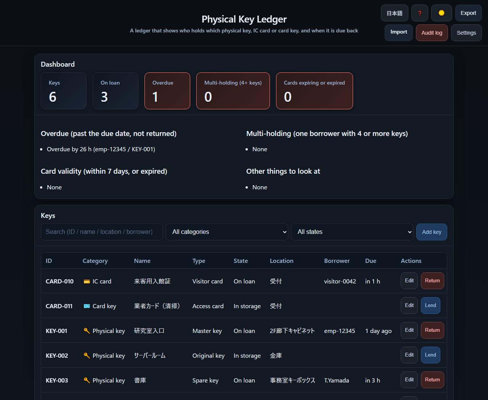
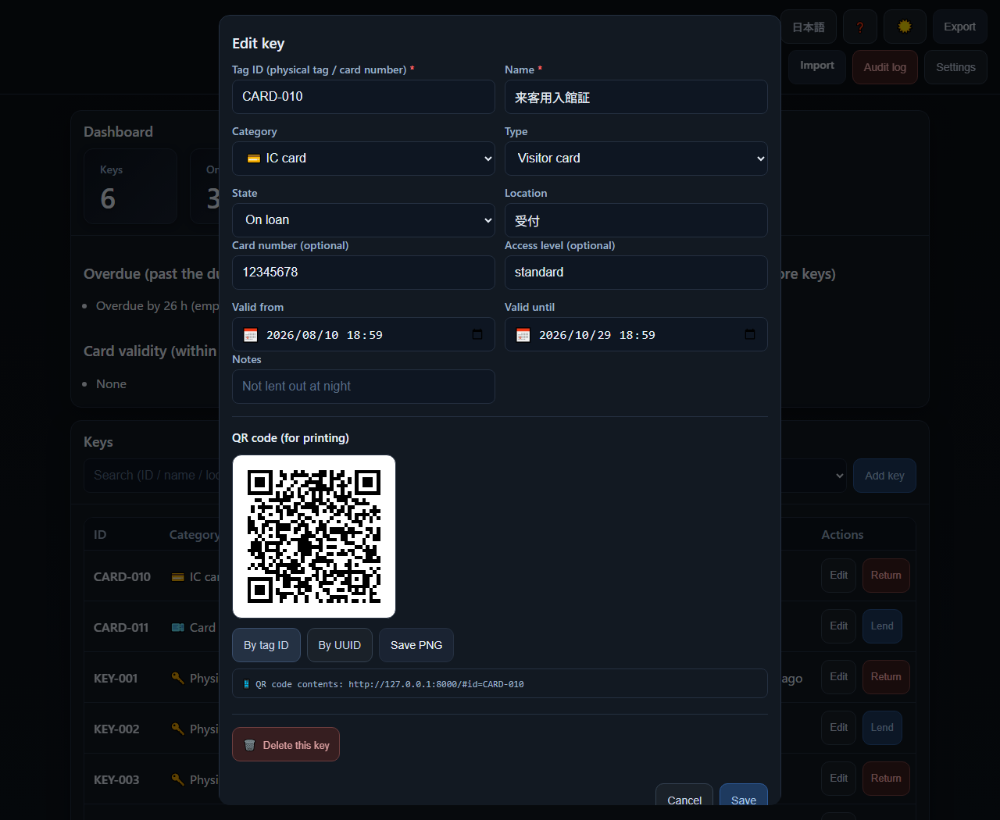
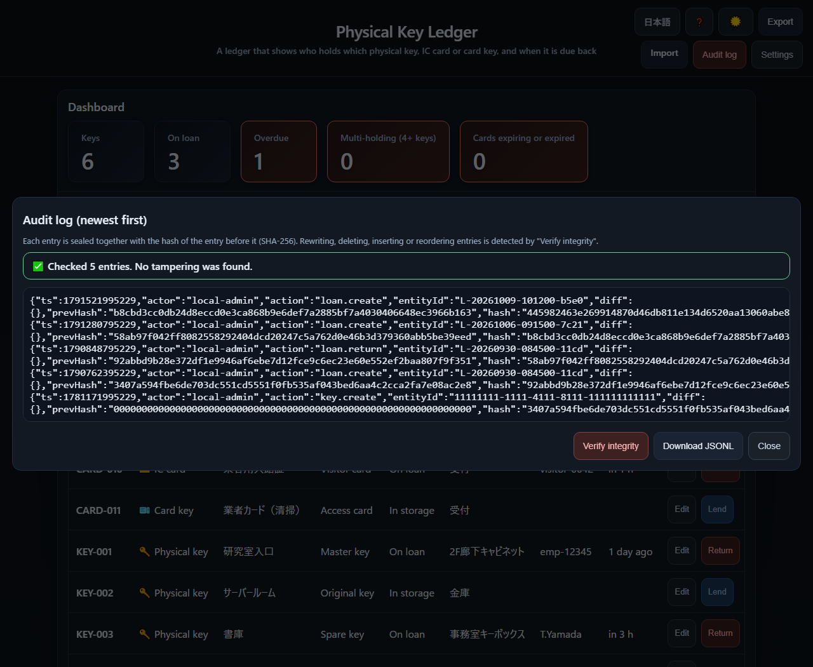
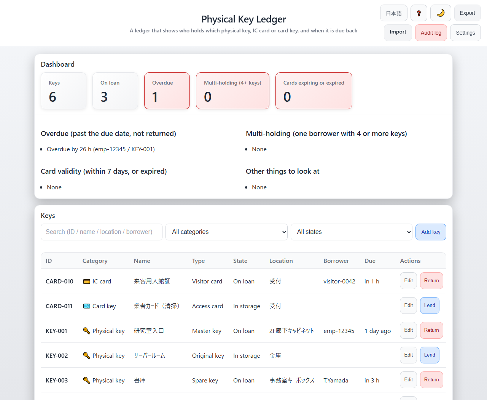

English · [日本語](README.md)

# Physical Key Ledger


[](https://ipusiron.github.io/physical-key-ledger/)

**Day087 - 100 Security Tools with Generative AI**

**Physical Key Ledger** is a web app that shows who holds which physical key, IC card or card key, so that fewer of them go missing.

A plain interface answers "who took what, and when" at a glance, which helps both with audits and with teaching.

It works as teaching material about the blind spots of physical key management, and as a practical aid in a lab or a small office.

---

## 🌐 Demo

👉 **[https://ipusiron.github.io/physical-key-ledger/](https://ipusiron.github.io/physical-key-ledger/)**

It runs in the browser, with nothing to install.

---

## 📸 Screenshots

>
>*Dashboard and key list. One loan is 26 hours overdue, and the retired key has no lend button*

>
>*The key editor. IC cards open the card number and validity fields, and the QR code carries a `#id=` link*

>
>*The audit log. Every entry has a sequence number, so two operations in the same millisecond cannot overwrite each other*

>
>*The light theme. Colours come from CSS variables, and the contrast ratios are fixed by tests*

---

## 👥 Who it is for

- Lab and seminar managers: teachers and assistants who lend lab keys and access cards to students
- Small office managers: back-office staff looking after employee badges and locker keys
- Co-working space operators: reception staff handing out member cards and meeting-room keys
- Facility managers: caretakers lending keys and cards at event halls, community centres and gyms
- Security trainers: instructors who want to teach physical security by doing rather than by telling
- Security learners: students and beginners who want to see how key management works in practice
- Personal use: anyone looking after several keys or cards at home or in a one-person business

---

## ✨ Features

- 🔑 Many kinds of key: physical keys, IC cards and card keys in one ledger
- 📋 Lend and return: who borrowed what, when, and when it came back
- ⚠️ Anomaly detection: overdue loans, multi-holding, expired cards, long master-key loans, and records that do not match the state of a key
- 📊 Dashboard: total keys, keys on loan, overdue loans and expiring cards
- 📝 Audit log: every operation recorded with a sequence number, downloadable as JSON Lines
- 🔗 Tamper detection: each log entry is sealed with the hash of the one before it, so rewriting, deleting, inserting and reordering are found by "Verify integrity"
- 📤 Import and export: JSON export, and import that replaces the ledger (nothing is imported unless the whole file passes validation)
- 🏷️ QR codes: a label per key. The link uses the fragment, so the key ID is never sent to the server
- 🌓 Light and dark themes: switched by hand, remembered by the browser
- 🌐 Japanese and English: switched on screen, or with `?lang=en`
- 🔒 No outside connections: every file comes from this origin, fixed by a Content-Security-Policy

---

## 📖 How to use it

### The basics

1. Register a key
   - Pick a category (physical key / IC card / card key)
   - Give it a tag number such as `KEY-001`, a name and a location
   - IC cards and card keys can also carry a card number, an access level and validity dates

2. Lend it
   - Enter the borrower (an employee number, a nickname, whatever identifies them) and the due date

3. Take it back
   - One click on "Return" updates the state

4. Check the dashboard
   - Overdue loans, multi-holding and expiring cards are listed there

5. Export
   - Save the ledger as JSON. The audit log travels with it

### Using the QR codes

1. Generate
   - In the key editor, press "By tag ID" or "By UUID"
   - The code appears with the URL behind it written underneath

2. Print
   - "Save PNG" saves the image, ready to print on a tag or a label

3. Scan
   - Scanning opens that key's detail view
   - For example `https://example.com/physical-key-ledger/#id=KEY-001`
   - **The ledger lives in one browser on one device, so the detail view only opens where the key was registered.** Scanning on another device says the key is not in this device's ledger

4. Two kinds of code
   - By tag ID: `#id=KEY-001`, looked up by the printed number
   - By UUID: `#key=a1b2c3d4...`, looked up by the internal id, which survives a change of tag

The identifier goes in the fragment (`#`). Browsers do not send the fragment to the server, so the key ID stays out of the access log of whoever hosts the page. It is removed from the address bar once it has been read (it does remain in the browser's own history). Older `?id=` labels are still understood.

---

## 📋 Audit log

### Why it matters

Every operation is written to an audit log, which is useful for:

- Traceability: who did what, and when
- Incident response: following the history back when a key goes missing or is misused
- Compliance: evidence for a security audit or an internal control review
- Operations: spotting the keys that are lent constantly, or returned late

### What is recorded

| Action | Meaning | Contents |
|---|---|---|
| `key.create` | A key was registered | All fields of the key (ID, name, category and so on) |
| `key.update` | A key was edited | A snapshot after the change |
| `key.delete` | A key was deleted | The UUID of the deleted key |
| `loan.create` | A key was lent | Borrower, time, due date, notes |
| `loan.return` | A key came back | Time of return, notes |
| `import` | Data was imported | How many keys, loans and log entries |

Each entry looks like this:

```json
{
  "seq": 42,
  "ts": 1696320000000,
  "actor": "local-admin",
  "action": "loan.create",
  "entityId": "L-20251003-143000-a1b2",
  "diff": { "...": "a snapshot of the change" },
  "prevHash": "…",
  "hash": "…"
}
```

### Examples

#### 1. Investigating an incident

Scenario: an important key is missing and you need to know who had it last.

```
Steps:
1. Press "Audit log"
2. Look for the key ID (for example KEY-005)
3. Read the loan.create and loan.return entries
4. The last person and time are in the newest loan.create
5. Download the log and attach it to the report
```

#### 2. Answering an audit

Scenario: an ISO 27001 audit asks for evidence of physical security controls.

```
Steps:
1. Press "Export" to download the JSON
2. The audit field holds the full history
3. Timestamps and the actor field say who did what
4. Hand the JSON (or a CSV made from it) to the auditor
```

#### 3. Looking at trends

Scenario: you want to know which keys are borrowed most often, to decide whether to cut a spare.

```
Steps:
1. Export the audit log
2. Filter for action: "loan.create"
3. Group the entries by key
4. The keys at the top are the ones under pressure
5. Consider a spare key, or a change in how they are used
```

#### 4. Checking for misuse

Scenario: did someone who has left still use a key afterwards?

```
Steps:
1. Search the audit log for their identifier (for example actor: "ex-employee-001")
2. Look for timestamps after their last day
3. If there are any, investigate
```

### How long to keep it

- In the browser: IndexedDB keeps it until it is deleted by hand
- Recommended: export monthly or quarterly and keep the copy somewhere else (USB, NAS, cloud storage)
- Long term: follow your own policy; a year is a common minimum

### Detecting tampering with a hash chain

Every entry is sealed together with the hash of the entry before it.

```
hash(n) = SHA-256( ts ‖ actor ‖ action ‖ entityId ‖ diff ‖ hash(n-1) )
```

The first entry links to sixty-four zeros instead of `hash(0)`. "Verify integrity" recomputes the whole chain and reports where it stops matching.

| How it is tampered with | Detected? | What happens |
|---|---|---|
| An entry is rewritten | Yes | Its hash no longer matches, and the sequence number points at it |
| An entry in the middle is deleted | Yes | The next entry's prevHash no longer connects |
| A forged entry is inserted | Yes | Same as above: the break is reported with its position |
| Entries are reordered | Yes | Either the sequence or the links break |
| The newest entries are cut off | Yes | The head (last sequence number and hash) kept in the settings store no longer matches |
| The whole ledger is rebuilt | No | A chain rebuilt from scratch is consistent with itself. Compare against exports kept elsewhere |

SHA-256 is implemented here with no dependencies (`js/sha256.js`) and checked against the NIST test vectors and Node.js's own `crypto` in the tests.

### What the log can and cannot do

The log cannot be edited or deleted from the screen, and entries are appended with an auto-incrementing sequence number. Two operations in the same millisecond both survive.

That said, the ledger sits in the browser's database in plain text, with no login. So it is possible to:

- Replace the whole ledger by importing another file (the audit log goes with it)
- Rewrite the database directly with developer tools

In other words, **it is not "impossible to tamper with", it is "impossible to tamper with from the screen", plus "tampering is detectable"**. If you need it as evidence, export it regularly, keep the copy elsewhere, and compare.

- Importing replaces the audit log as well. Export before you import
- The log can contain personal information (borrower names), so treat it accordingly

---

## 💾 Data (examples)

### A physical key

```json
{
  "id": "KEY-001",
  "uuid": "a1b2c3d4-...",
  "category": "physical-key",
  "name": "Lab entrance",
  "type": "original",
  "status": "stored",
  "location": "Cabinet, 2nd floor corridor",
  "notes": "Not lent out at night"
}
```

### An IC card

```json
{
  "id": "CARD-12345",
  "uuid": "e5f6a7b8-...",
  "category": "ic-card",
  "name": "Employee badge (T. Yamada)",
  "type": "employee",
  "status": "loaned",
  "cardNumber": "12345678",
  "accessLevel": "standard",
  "validFrom": 1704067200000,
  "validUntil": 1735689599000,
  "location": "HR department",
  "notes": "Report immediately if lost"
}
```

## 📝 The fields

### Key editor

| Field | Required | Meaning | Example | Note |
|---|---|---|---|---|
| Tag ID | ⭐ | The number on the physical tag or card | `KEY-001`, `CARD-12345` | Goes into the QR code. Must be unique |
| Name | ⭐ | What the key opens | `Lab entrance` | Any script. Make it recognisable |
| Category | - | Physical key / IC card / card key | `Physical key` | Changing it changes the type list |
| Type | - | A finer classification | `Master key`, `Employee badge` | Depends on the category |
| State | - | Where the key is now | `In storage`, `On loan`, `Retired` | Lending sets it to "On loan" by itself |
| Location | - | Where it is kept | `Cabinet, 2nd floor corridor` | Where to look for it |
| Notes | - | Anything else | `Not lent out at night` | Free text |

#### Card-only fields (IC cards and card keys)

| Field | Required | Meaning | Example | Note |
|---|---|---|---|---|
| Card number | - | The number printed on the card | `12345678` | |
| Access level | - | Permission level | `standard`, `admin` | For your own classification |
| Valid from | - | Start of the validity period | `2024-01-01 09:00` | 📅 from the calendar |
| Valid until | - | End of the validity period | `2024-12-31 23:59` | 📅 Cards near this date appear on the dashboard |

### Lending

| Field | Required | Meaning | Example | Note |
|---|---|---|---|---|
| Key ID | - | The key being lent | `KEY-001` | Filled in for you |
| Borrower | ⭐ | Who is taking it | `emp-12345`, `T.Yamada` | Employee number, student number, name |
| Due | - | When it should come back | `2024-01-15 17:00` | 📅 from the calendar. Overdue loans are flagged |
| Notes | - | Anything about this loan | `Daytime inspection` | |

### Returning

| Field | Required | Meaning | Example | Note |
|---|---|---|---|---|
| Key ID | - | The key coming back | `KEY-001` | Filled in for you |
| Borrower | - | Who had it | `T.Yamada` | Filled in for you |
| Notes | - | Anything about the return | `No damage` | The state of the key, for instance |

### Categories and types

#### 🔑 Physical key

| Type | Meaning | Used for |
|---|---|---|
| Master key | Opens every lock | Building and facility management |
| Original key | The manufacturer's key | Everyday access |
| Spare key | A copy | A backup when one is lost |

#### 💳 IC card

| Type | Meaning | Used for |
|---|---|---|
| Employee badge | For staff | Office access |
| Visitor card | Temporary, for guests | Receiving visitors |
| Contractor card | For builders and cleaners | Maintenance |
| Temporary card | Short-term | Events, training |
| Other | Anything else | Special cases |

#### 🎫 Card key

| Type | Meaning | Used for |
|---|---|---|
| Room key | A hotel room | Accommodation |
| Access card | Entering a building | Office buildings |
| Parking card | A car park gate | Parking management |
| Locker key | A locker | Changing rooms, storage |
| Other | Anything else | Special cases |

---

## 🏷️ Working with physical tags

- Tag numbers are easiest as plain ASCII: `KEY-001`, `CARD-12345`, `LOCKER-A01`
- Category: physical key, IC card or card key
- The type list follows the category
  - Physical key: master / original / spare
  - IC card: employee badge / visitor / contractor / temporary / other
  - Card key: room key / access card / parking card / locker key / other
- The UUID is the internal identifier: the history survives a change of printed number
- Any language works in `name`, `location` and `notes` (UTF-8)
- QR codes let a phone open the right key straight away
- Card-only fields carry the card number, access level and validity dates
- Lost or broken keys are marked `retired` rather than deleted

---

## 🎯 Use cases

### Ways of using this tool in particular

What the tool actually computes is: a state machine (in storage, on loan, retired), a count of what one person holds at the same time, the time since a due date, and an append-only record of operations. Read those as other questions, and the tool is useful beyond keys.

- See where access is concentrated (managers): set the multi-holding threshold to 1 and everyone currently holding a key appears on the dashboard. In the example below (4 loans, 2 borrowers) a threshold of 4 shows nothing, 3 shows one person and 1 shows both. It answers "has one person quietly ended up with everything" from the actual holdings, not from the org chart
- Look for single points of failure (facilities): filter by the master key type and you see how many keys open every door, and who has them. A single master key on a long loan is the single point of failure of the whole scheme
- Practise chain of custody (teaching and research): read "key" as "evidence", "sample" or "reagent" and the handover record itself becomes the subject. Lend and return a few times with the borrower as the custodian, then read the audit log as a timeline
- Experience tamper detection (training): rewrite one audit entry with developer tools, then press "Verify integrity": it names the entry that changed. Rebuild the whole ledger instead and nothing is detected. The difference between "cannot be tampered with" and "tampering can be detected" is something to show, not to explain
- Count how late things come back (operations): overdue loans are shown in hours. Export the JSON and take the gap between `dueAt` and `returnedAt` in `loans` to see which keys and which people are habitually late. A key that is always late is usually telling you something about the process
- Keep track of anything lent out (everyday life): tools, camera gear, books, a bicycle key. Anything handed over and expected back fits the same state machine, and the notes field is free text

The multi-holding count changes with the threshold like this (4 loans: borrower A has 3, borrower B has 1):

| Threshold | Reported | Who |
|---|---|---|
| 1 | 2 | A (3 keys), B (1 key) |
| 2 | 1 | A (3 keys) |
| 3 | 1 | A (3 keys) |
| 4 | 0 | Nobody |

### Other uses

- Keys, IC cards and card keys in a lab or small office, in one place
- Teaching material for the blind spots of key management
- Temporary key handling at events and venues
- Member cards and meeting-room keys in a co-working space
- The defending side of a physical security test
- A practical exercise for a class on physical security and audit trails
- Together with other tools: in [Intrusion Path Mapper (Day083)](https://ipusiron.github.io/intrusion-path-mapper/), the stretches of a path that a key protects can be matched against who is holding that key right now

There is no intention to narrow down what it is for. The one line worth keeping is that there is no login and no encryption here, so it is not the place for the keys of a facility that matters.

---

## 💼 Longer scenarios

### 1. Keys and cards in a university lab

Background:
A lab has physical keys to the room, IC cards for the building and card keys for lockers. Students come and go every year, and nobody is sure who holds what.

What to do:
1. Register everything: 3 room keys (1 master, 2 spares), 10 building cards (9 for students, 1 for visitors), 5 locker keys
2. Print a QR label for each one. A student scans it and the lending form opens
3. Set a common due date at the end of term, and watch the dashboard for whoever is late
4. When a student graduates, read their history in the audit log and check that nothing is still out

Result:
- Less risk of loss: the last holder is immediately clear
- Students manage themselves better when they can see the record
- Less paperwork than a paper ledger

---

### 2. Access cards in a co-working space

Background:
Members get building cards, meeting rooms have card keys, and lockers have keys. Several people take turns at reception, so the state of the loans has to be visible to all of them.

What to do:
1. Register by category:
   - IC cards: 50 for members, 10 for day passes
   - Card keys: 3 meeting rooms, 20 lockers
2. Set the multi-holding threshold to 2 to see when one person has several cards
3. Give day-pass cards a validity date; the dashboard warns before they expire
4. Export at the end of the month for the billing system

Result:
- The handover between receptionists is a glance at a screen
- Multi-holding and expiry are flagged early
- Monthly reporting stops being manual

---

### 3. Teaching material for a security workshop

Background:
A new-employee course wants to show the blind spots of physical security, not just describe them.

What to do:
1. Split the group and give each team a fictional office to manage
2. The instructor plants incidents: an overdue loan, multi-holding, a forgotten return
3. Each team watches the dashboard and discusses what to do
4. Afterwards, read the audit log together: who did what, and when

Why it works:
- Using a real tool produces questions that a lecture does not
- Mistakes are made on purpose, then detected and handled
- Having a trail makes responsibility concrete

Result:
- Physical security stops being abstract
- The group practises responding to an incident
- The habit of recording spreads

---

### 4. A physical penetration test

Background:
A red team tests the physical perimeter. A paper ledger can be rewritten, and loans can go unrecorded, which is exactly the blind spot being tested.

What to do:
1. Before the test (blue team):
   - Register every key, IC card and card key
   - Attach QR labels and insist on recording every handover
   - Set the multi-holding threshold to 2

2. Attacks the red team might try:
   - Social engineering: "I left something inside", asking reception for a card
   - Tailgating: following a member of staff in, then borrowing a locker key
   - Impersonating a manager: demanding the master key for "emergency maintenance"
   - Abusing the due date: asking for a long loan and not returning it, to gain time for a copy

3. Detection:
   - The dashboard shows overdue loans and multi-holding as they happen
   - The audit log says who approved what, and when
   - Unusual patterns (several loans in a short time, loans to unregistered people) stand out

4. Reporting:
   - The red team reconstructs the route from the log
   - The blue team looks at what was not detected and changes the rules
   - For example: emergency loans need a manager, scanning the QR code becomes mandatory

| Attack | Paper ledger | Physical Key Ledger |
|---|---|---|
| Rewriting a loan record | Possible (rewrite the page) | Not from the screen, and a rewrite of the database is detected by the hash chain. A ledger rebuilt from scratch is not, so keep exports elsewhere |
| Borrowing without recording | Hard to notice | Detectable: a stocktake finds a key whose state and location do not agree |
| Holding several items | Hard to see | Flagged immediately (the threshold is configurable) |
| Forgetting to return | Needs a manual check | Flagged automatically (only for loans that were given a due date) |
| Who approved it | Not recorded | In the `actor` field (the profile name; there is no login, so it is self-declared) |

Result:
- Weaknesses that the paper ledger hid become numbers
- The route of an incident is found quickly
- Each test produces a change in the rules

Notes on red team work:
- This tool belongs to the defending side; it is not an attack tool
- A physical penetration test needs written authorisation beforehand
- Write the report, and include what to change

---

## ⚠️ Security and privacy

### Where the data lives, and whose responsibility it is

- All data is stored locally in the browser's IndexedDB
  - Nothing is sent to a server
  - Looking after it is up to you
  - Clearing the browser's site data deletes it

### Using it in public

This tool is meant for demonstration, teaching and personal use. It is **not** suitable for managing the keys of something that matters.

Reasonable:
- ✅ A security workshop with made-up data
- ✅ Personal key management, at your own risk
- ✅ A trial in a small office, for keys of low importance
- ✅ The defending side of an exercise, with test data

Not reasonable:
- ❌ Keys to critical infrastructure
- ❌ Master keys of a secure facility
- ❌ Production use on a shared public computer
- ❌ Real card data of real people

### About the GitHub Pages copy

- The published page is there to demonstrate and to teach
- Do not enter production data (it stays in your browser, but mistakes happen)
- What you enter is never sent to the server hosting the page. QR links use the fragment, so key IDs stay out of the access log
- For anything sensitive, run it locally or on your own server

### Good practice

1. Export regularly
2. Use it on a browser and a device you trust
3. Encrypt the exports if they matter
4. On a shared machine, close the browser afterwards
5. Run "Verify integrity" from time to time, and compare against an export kept elsewhere

---

## ⚙️ Limitations

- Data is stored per browser and is not synchronised between devices
- Import replaces everything; there is no merge
- PWA support, notifications and multi-user permissions are not implemented
- QR codes are generated here, but scanning is left to the phone's own reader
- No login: anyone who can open the browser can read and change the ledger
- No encryption: IndexedDB holds the data in plain text
- Tampering with the audit log can be **detected**, not **prevented** (see the table above)
- The interface is available in Japanese and English only

---

## 📁 Directory structure

```
physical-key-ledger/
├── .github/                      # GitHub configuration
│   └── workflows/                # GitHub Actions workflows
│       └── test.yml              # Runs npm test on push and pull request
├── assets/                       # Images used by the READMEs
│   ├── en/                       # Screenshots of the English interface
│   │   ├── screenshot.png        # Dashboard and key list (dark)
│   │   ├── screenshot2.png       # Key editor and QR code
│   │   ├── screenshot3.png       # Audit log
│   │   └── screenshot4.png       # Dashboard and key list (light)
│   ├── screenshot.png            # Dashboard and key list (dark)
│   ├── screenshot2.png           # Key editor and QR code
│   ├── screenshot3.png           # Audit log
│   └── screenshot4.png           # Dashboard and key list (light)
├── css/                          # Stylesheet
│   └── style.css                 # Colours (CSS variables), layout, light/dark
├── js/                           # The application (ES Modules)
│   ├── anomaly.js                # Anomaly detection and KPIs (pure functions)
│   ├── audit-chain.js            # The audit hash chain and its verification (pure)
│   ├── db.js                     # IndexedDB (schema v3: keys, loans, audit, meta)
│   ├── display.js                # Labels, relative time, date conversion (pure)
│   ├── i18n.js                   # Language selection and text replacement
│   ├── logic.js                  # Ledger operations (register, lend, return, import/export)
│   ├── messages.js               # Japanese and English text (screen, errors, help)
│   ├── sha256.js                 # SHA-256 (no dependencies, synchronous)
│   ├── ui.js                     # Rendering and event handling
│   └── validate.js               # Validation of imports and form input (pure)
├── test/                         # Tests (node:test, no dependencies)
│   ├── anomaly.test.js           # Anomaly detection and KPIs
│   ├── audit-chain.test.js       # Rewriting, deletion, insertion, truncation
│   ├── contrast.test.js          # Colour contrast and target sizes
│   ├── display.test.js           # Labels, relative time, date round trips
│   ├── format.test.js            # Line length, file length, invisible characters
│   ├── html.test.js              # CSP, inline attributes, aria, element ids
│   ├── i18n.test.js              # Dictionary parity and language selection
│   ├── readme.test.js            # README tables, tree, images, wording
│   ├── sha256.test.js            # NIST test vectors and node:crypto
│   └── validate.test.js          # Rejecting invalid import data
├── vendor/                       # Bundled third-party library
│   ├── LICENSE-qrcodejs.txt      # QRCode.js licence (MIT)
│   ├── README.md                 # Origin, version, SHA-256, SRI
│   └── qrcode.min.js             # QRCode.js 1.0.0 (unmodified)
├── .gitignore                    # Git exclusions
├── .nojekyll                     # Stops Jekyll processing on GitHub Pages
├── CLAUDE.md                     # Notes for Claude Code
├── LICENSE                       # MIT licence
├── README.en.md                  # This file
├── README.md                     # Japanese README
├── TECHNICAL.md                  # Technical documentation
├── index.html                    # Page structure (CSP, modals, help)
└── package.json                  # The npm test script (no dependencies)
```

### What the main files do

- index.html: the structure of the page, including the CSP, the modals and the help
- db.js: the IndexedDB v3 schema, and the transactions that write keys, loans and the audit log together
- logic.js: registering, lending, returning, importing and exporting; the calculations are left to the pure modules
- anomaly.js / display.js / validate.js: the parts that never touch the DOM, which `npm test` exercises directly
- ui.js: drawing the table and the dashboard, generating QR codes, handling scanned links
- style.css: theming with CSS variables, and the responsive layout
- TECHNICAL.md: architecture, core algorithms and implementation notes ([read it here](TECHNICAL.md))

---

## 🧪 Tests

The logic lives in pure modules (`js/anomaly.js`, `js/display.js`, `js/validate.js`, `js/audit-chain.js`, `js/sha256.js`) that can be checked with the Node.js test runner alone. There are no dependencies.

```bash
npm test     # node --test
```

- Node.js 22 or newer is required (`node:test` and `node:assert/strict`)
- `.github/workflows/test.yml` runs them on push and on pull requests
- The numbers in both READMEs are recomputed by `test/readme.test.js`

| Test | What it checks |
|---|---|
| `test/anomaly.test.js` | Overdue loans, multi-holding, expiring cards, long master-key loans, mismatched records, KPIs |
| `test/audit-chain.test.js` | Rewriting, deletion, insertion, reordering and truncation of the audit log |
| `test/contrast.test.js` | Contrast ratios in both themes, and the size of the controls |
| `test/display.test.js` | Labels, the boundaries of relative time, date round trips and invalid dates |
| `test/format.test.js` | Line length, file length and invisible characters in the sources |
| `test/html.test.js` | CSP directives, absence of inline attributes, script origins, aria, element ids |
| `test/i18n.test.js` | Dictionary parity, placeholders, tag counts, language selection |
| `test/readme.test.js` | README tables, directory tree, image references, wording |
| `test/sha256.test.js` | SHA-256 against the NIST vectors and against node:crypto |
| `test/validate.test.js` | Rejecting invalid import data (UUID format, uniqueness, types) |

---

## 💻 Requirements

- A current browser (Chrome, Edge, Firefox or Safari)
- JavaScript and IndexedDB
- No internet connection is needed: there is no CDN, and QRCode.js is bundled

To run it locally, serve the directory over HTTP. Opening `index.html` as a `file://` URL does not work: the browser refuses to load the ES modules, and the page stays empty.

```bash
cd physical-key-ledger
python -m http.server 8000
# then open http://localhost:8000/
```

---

## 📄 Licence

MIT License – see [LICENSE](LICENSE).

QR codes are generated with [QRCode.js](https://github.com/davidshimjs/qrcodejs) (MIT License, Copyright (c) 2012 davidshimjs), bundled in this repository. Its origin and hashes are recorded in [vendor/README.md](vendor/README.md).

---

## 🛠️ About this tool

This tool is part of "100 Security Tools with Generative AI", a project in which one security-related tool is built and published every day for 100 days, with the help of generative AI.

For the project and the other tools:

🔗 [https://akademeia.info/?page_id=42163](https://akademeia.info/?page_id=42163)
