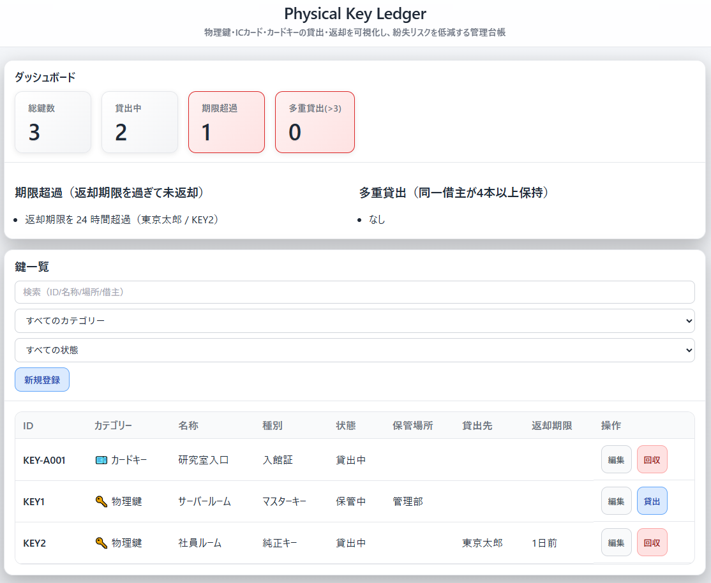

<!--
---
title: Physical Key Ledger
category: physical-security
difficulty: 2
description: Lightweight web-based ledger for managing physical keys: track loans, returns, and anomalies with QR tag support.
tags: [physical-security, key-management, ledger, education, javascript]
demo: https://ipusiron.github.io/physical-key-ledger/
---
-->

# Physical Key Ledger - 物理鍵管理台帳


[](https://ipusiron.github.io/physical-key-ledger/)

**Day087 - 生成AIで作るセキュリティツール100**

**Physical Key Ledger** は、物理鍵・ICカード・カードキーの貸出・回収を可視化し、紛失リスクを低減するためのWebアプリです。

シンプルなUIで「誰が・いつ・どの鍵を利用したか」を即座に把握でき、監査やセキュリティ教育に役立ちます。

物理的な鍵管理の盲点を教育的に示す教材としても、研究室や小規模オフィスでの実務補助としても利用できます。

---

## 🌐 デモページ

👉 **[https://ipusiron.github.io/physical-key-ledger/](https://ipusiron.github.io/physical-key-ledger/)**

ブラウザーで直接お試しいただけます。

---

## 📸 スクリーンショット

>
>*物理鍵の管理ダッシュボード*

---

## 🎯 対象ユーザー

- **研究室・ゼミ管理者**: 実験室の鍵や入館カードを学生に貸し出す教員・助手
- **小規模オフィス管理者**: 社員証やロッカーキーを管理する総務・事務担当
- **シェアオフィス運営者**: 会員向けの入館カードや会議室キーを貸し出す受付スタッフ
- **施設管理者**: イベント会場・公民館・体育館などで鍵やカードを一時貸出する管理人
- **セキュリティ教育担当者**: 物理セキュリティの重要性を体験的に教えたい研修講師
- **情報セキュリティ学習者**: 物理セキュリティの実践的な管理方法を学びたい学生・初学者
- **個人利用**: 自宅や個人事業で複数の鍵・カードを管理したい方

---

## ✨ 特徴

- 🔑 **多様な鍵に対応**：物理鍵・ICカード・カードキーを統合管理
- 📋 **貸出／回収フロー**：誰が・いつ・どの鍵を借りたか、返却したかを記録
- ⚠️ **アノマリー（振る舞い）検知**：平常時とは異なる挙動（期間超過、多重貸出など）をした場合に異常として警告
- 📊 **ダッシュボード**：総鍵数、貸出中、期限超過などを可視化
- 📝 **監査ログ**：すべての操作を時系列で記録、JSON Linesでエクスポート可能
- 📤 **データ入出力**：JSONによるエクスポート／インポート（全置換）
- 🏷️ **QRコード連携**：鍵ごとのQRラベルを生成し、スキャンで詳細画面に直接アクセス
- 🌓 **ライト/ダークモード**：手動切替可能、設定はブラウザーに永続化  

---

## 📖 利用方法

### 基本的な使い方

1. **鍵を登録**
   - カテゴリー（物理鍵/ICカード/カードキー）を選択
   - `KEY-001` のような番号で物理タグを付与し、名称・保管場所を入力
   - ICカード・カードキーの場合は、カード番号・アクセスレベル・有効期限も登録可能

2. **貸出登録**
   - 借主識別子（社員番号やニックネームなど）と返却期限を入力

3. **回収登録**
   - 鍵を返却したらワンクリックでステータス更新

4. **アノマリー確認**
   - ダッシュボードで期限超過や多重貸出をチェック

5. **エクスポート**
   - JSON形式でバックアップ。監査ログも追記専用で残る

### QRコードの活用方法

1. **QRコード生成**
   - 鍵の編集画面で「IDで生成」または「UUIDで生成」ボタンをクリック
   - QRコードが表示され、下部に埋め込まれたURL情報が表示される

2. **QRコード印刷**
   - 「PNG保存」ボタンでQRコード画像を保存
   - 物理タグやラベルに印刷して鍵に貼付

3. **QRコードスキャン**
   - スマホのQRコードリーダーでスキャン
   - URLにアクセスすると、自動的にその鍵の詳細画面（編集モーダル）が開く
   - 例: `https://example.com/physical-key-ledger/?id=KEY-001`

4. **2種類のQRコード**
   - **IDで生成**: `?id=KEY-001` 形式。タグ番号で検索
   - **UUIDで生成**: `?key=a1b2c3d4...` 形式。内部IDで検索。タグ番号変更にも対応  

---

## 📋 監査ログ

### 監査ログの意義

本ツールはすべての操作を**監査ログ（Audit Log）**として記録します。

監査ログは以下の目的で活用できます。

- **トレーサビリティの確保**: 誰が・いつ・何をしたかを追跡可能
- **インシデント調査**: 鍵の紛失や不正利用の発覚時に操作履歴を遡って分析
- **コンプライアンス対応**: セキュリティ監査や内部統制の証跡として提出
- **運用改善**: 頻繁に貸出される鍵や返却遅延の傾向を分析

### 記録される操作

監査ログには以下の操作が自動記録されます。

| アクション | 説明 | 記録内容 |
|-----------|------|---------|
| `key.create` | 鍵の新規登録 | 鍵のすべてのフィールド（ID、名称、カテゴリーなど） |
| `key.update` | 鍵情報の更新 | 更新後のスナップショット |
| `key.delete` | 鍵の削除 | 削除された鍵のUUID |
| `loan.create` | 貸出登録 | 借主、貸出日時、返却期限、メモ |
| `loan.return` | 鍵の回収 | 返却日時、回収時メモ |
| `import` | データインポート | インポートされた件数（鍵/貸出/ログ） |

各エントリには以下の情報が含まれます。

```json
{
  "ts": 1696320000000,
  "actor": "local-admin",
  "action": "loan.create",
  "entityId": "L-20251003-143000-a1b2",
  "diff": { /* 変更内容のスナップショット */ }
}
```

### 監査ログの活用例

#### 1. インシデント調査

**シナリオ**: 重要な鍵が紛失し、最後に誰が使用したかを調査する

```
手順:
1. 「監査ログ」ボタンをクリック
2. 検索ボックスで鍵ID（例: KEY-005）を検索
3. loan.create と loan.return の履歴を確認
4. 最後に貸出した人物と日時を特定
5. 必要に応じてログをCSV保存して報告書に添付
```

#### 2. セキュリティ監査対応

**シナリオ**: ISO 27001の監査で「物理セキュリティの統制証跡」を求められた

```
手順:
1. 「エクスポート」ボタンでJSONファイルをダウンロード
2. audit フィールドに全操作履歴が含まれている
3. タイムスタンプとアクターで操作者が明確
4. 監査人にJSON（または変換したCSV）を提出
```

#### 3. 運用傾向の分析

**シナリオ**: どの鍵が頻繁に貸出されているかを把握し、予備キーの準備を検討

```
手順:
1. 監査ログをエクスポート
2. action: "loan.create" をフィルター
3. entityId（貸出ID）から keyUuid をグループ化
4. 貸出回数の多い鍵を特定
5. 高頻度の鍵は追加購入や運用見直しを検討
```

#### 4. 不正利用の検出

**シナリオ**: 退職者が退職後も鍵を使用していないか確認

```
手順:
1. 監査ログで actor フィールドを検索（例: actor: "ex-employee-001"）
2. 退職日以降のタイムスタンプがないか確認
3. もし記録があれば、不正アクセスの可能性を調査
```

### 監査ログの保管期間

- **ブラウザー内保管**: IndexedDB に無期限保存（手動削除しない限り残る）
- **推奨運用**: 月次・四半期ごとにエクスポートして外部保管（USB/NAS/クラウドストレージ）
- **長期保管**: セキュリティポリシーに従い最低1年間は保管を推奨

### 注意事項

- 監査ログは追記専用であり、編集・削除機能はありません（改ざん防止）
- データインポート時に監査ログも上書きされるため、インポート前に必ずバックアップを取得してください
- 監査ログには個人識別情報（借主名など）が含まれる可能性があるため、取り扱いには注意が必要です

---

## 💾 データ構造（例）

### 物理鍵

```json
{
  "id": "KEY-001",
  "uuid": "a1b2c3d4-...",
  "category": "physical-key",
  "name": "研究室入口",
  "type": "original",
  "status": "stored",
  "location": "2F廊下キャビネット",
  "notes": "夜間は貸出不可"
}
```

### ICカード

```json
{
  "id": "CARD-12345",
  "uuid": "e5f6g7h8-...",
  "category": "ic-card",
  "name": "社員証（山田太郎）",
  "type": "employee",
  "status": "loaned",
  "cardNumber": "12345678",
  "accessLevel": "standard",
  "validFrom": 1704067200000,
  "validUntil": 1735689599000,
  "location": "人事部管理",
  "notes": "紛失時は即時報告"
}
```

## 📝 入力項目一覧

### 鍵登録画面の入力項目

| 項目名 | 必須 | 説明 | 入力例 | ヒント |
|--------|------|------|--------|--------|
| **表示ID** | ⭐ | 物理タグやカード番号 | `KEY-001`, `CARD-12345` | 半角英数字推奨。QRコードに埋め込まれます |
| **名称** | ⭐ | 鍵・カードの名前 | `研究室入口`, `社員証（山田）` | 日本語OK。用途がわかる名前を推奨 |
| **カテゴリー** | - | 物理鍵/ICカード/カードキー | `物理鍵` | 選択すると種別が自動で切り替わります |
| **種別** | - | カテゴリーに応じた詳細分類 | `マスターキー`, `社員証` | カテゴリー選択後に表示される選択肢から選択 |
| **状態** | - | 現在の状態 | `保管中`, `貸出中`, `廃止` | 貸出時に自動で「貸出中」に変更されます |
| **保管場所** | - | 鍵の保管場所 | `2F廊下キャビネット` | 保管中の鍵がどこにあるかを記録 |
| **メモ** | - | 補足情報 | `夜間は貸出不可` | 運用上の注意事項などを自由記述 |

#### カード固有フィールド（ICカード・カードキー選択時のみ表示）

| 項目名 | 必須 | 説明 | 入力例 | ヒント |
|--------|------|------|--------|--------|
| **カード番号** | - | カードの物理番号 | `12345678` | カード表面に印字された番号 |
| **アクセスレベル** | - | 権限レベル | `standard`, `admin` | 管理用の分類に使用 |
| **有効期限（開始）** | - | 利用開始日時 | `2024-01-01 09:00` | 📅カレンダーから選択可能 |
| **有効期限（終了）** | - | 利用終了日時 | `2024-12-31 23:59` | 📅カレンダーから選択可能 |

### 貸出登録画面の入力項目

| 項目名 | 必須 | 説明 | 入力例 | ヒント |
|--------|------|------|--------|--------|
| **鍵ID** | - | 貸し出す鍵のID | `KEY-001` | 自動入力（変更不可） |
| **借主識別子** | ⭐ | 借りる人の識別情報 | `emp-12345`, `T.Yamada` | 社員番号、学籍番号、氏名など |
| **返却期限** | - | いつまでに返却すべきか | `2024-01-15 17:00` | 📅カレンダーから選択可能。期限超過は自動検知 |
| **メモ（貸出）** | - | 貸出時の特記事項 | `日中点検` | 貸出目的や条件など |

### 回収登録画面の入力項目

| 項目名 | 必須 | 説明 | 入力例 | ヒント |
|--------|------|------|--------|--------|
| **鍵ID** | - | 回収する鍵のID | `KEY-001` | 自動入力（変更不可） |
| **借主（参考）** | - | 誰から回収したか | `T.Yamada` | 自動入力（参考情報） |
| **返却メモ** | - | 回収時の特記事項 | `破損なし` | 鍵の状態などを記録 |

### カテゴリーと種別の対応表

#### 🔑 物理鍵

| 種別 | 説明 | 用途例 |
|------|------|--------|
| **マスターキー** | すべての錠前を開けられる | ビル管理、施設管理 |
| **純正キー** | メーカー製の正規品 | 通常の入退室 |
| **スペアキー** | 合鍵・予備鍵 | 紛失時のバックアップ |

#### 💳 ICカード

| 種別 | 説明 | 用途例 |
|------|------|--------|
| **社員証** | 従業員向けカード | オフィス入退館 |
| **訪問者カード** | 来客用の一時カード | 来客対応 |
| **業者カード** | 工事・清掃業者用 | メンテナンス時 |
| **一時カード** | 短期利用カード | イベント、研修 |
| **その他** | 上記に該当しないカード | 特殊用途 |

#### 🎫 カードキー

| 種別 | 説明 | 用途例 |
|------|------|--------|
| **客室キー** | ホテルの部屋用 | 宿泊施設 |
| **入館証** | 建物入館用 | オフィスビル |
| **駐車場カード** | 駐車場ゲート開閉用 | 駐車場管理 |
| **ロッカーキー** | ロッカー開閉用 | 更衣室、保管庫 |
| **その他** | 上記に該当しないカード | 特殊用途 |

---

## 🏷️ 物理タグ運用ガイドライン

- **タグ番号は半角英数字推奨**：`KEY-001`, `CARD-12345`, `LOCKER-A01` など
- **カテゴリー選択**: 物理鍵・ICカード・カードキーから選択
- **種別の自動切替**: カテゴリーに応じて種別オプションが動的に変更
  - 物理鍵: マスターキー/純正キー/スペアキー
  - ICカード: 社員証/訪問者カード/業者カード/一時カード/その他
  - カードキー: 客室キー/入館証/駐車場カード/ロッカーキー/その他
- **UUIDは内部識別子**：番号が変わっても履歴の一貫性を維持
- **日本語もOK**：`name`, `location`, `notes` に利用可能（UTF-8）
- **QRコード併用**：スマホでスキャンして詳細画面に直接アクセス可能
- **カード固有フィールド**: ICカード・カードキーではカード番号、アクセスレベル、有効期限を登録可能
- **廃止時は status=retired** として扱う  

---

## 🎓 想定ユースケース

- 研究室や小規模オフィスでの物理鍵・ICカード・カードキーの統合管理
- 教育現場で「鍵管理の盲点」を体験させる教材
- イベント運営や施設管理での一時的な鍵・カード管理
- シェアオフィスでの入館カード・会議室キーの貸出管理
- レッドチームによる物理セキュリティテストの防御側ツール

---

## 💼 活用シナリオ

### シナリオ1: 大学研究室での鍵・カード統合管理

**背景:**
大学の研究室では、実験室の物理鍵、建物入館用ICカード、ロッカーのカードキーなど、多様なアクセス手段を管理する必要があります。学生の入れ替わりが激しく、「誰が何を持っているか」の把握が困難でした。

**活用方法:**
1. **初期登録**: 実験室の鍵3本（マスター1本、スペア2本）、入館ICカード10枚（学生用9枚、来客用1枚）、ロッカーキー5枚を登録
2. **QRコード運用**: 各鍵・カードにQRラベルを印刷して貼付。学生がスマホでスキャンして即座に貸出登録
3. **期限管理**: 学期末に一斉返却期限を設定。期限超過者をダッシュボードで可視化
4. **監査**: 卒業時や退学時に、該当学生の貸出履歴を監査ログで確認し、未返却がないかチェック

**効果:**
- 紛失リスク低減（誰が最後に使ったか即座に特定）
- 学生の自主管理意識向上
- 事務作業の削減（紙台帳からの脱却）

---

### シナリオ2: シェアオフィスでの入退館カード管理

**背景:**
シェアオフィスでは、会員向けの入館ICカード、会議室のカードキー、施設内ロッカーの鍵を貸し出しています。複数の管理者が交代で受付業務を行うため、貸出状況の共有が課題でした。

**活用方法:**
1. **カテゴリー別登録**:
   - ICカード: 正会員用50枚（社員証タイプ）、一時会員用10枚
   - カードキー: 会議室A/B/Cの3枚、ロッカー用20枚
2. **多重貸出検知**: しきい値を2に設定し、1人が複数カードを保持していないか監視
3. **有効期限管理**: 一時会員カードに1ヶ月の有効期限を設定し、期限切れを自動検知
4. **データエクスポート**: 月末に貸出データをJSON出力し、会計システムと連携

**効果:**
- 管理者間での情報共有がスムーズ（ブラウザーベースで端末不問）
- 不正利用の早期発見（多重保持・期限切れの即時アラート）
- 月次レポート作成の自動化

---

### シナリオ3: セキュリティ教育ワークショップでの教材利用

**背景:**
企業の新入社員研修で「物理セキュリティの盲点」を体験的に学ばせたい。座学だけでなく、実際の鍵管理ツールを使って運用の難しさを理解させたい。

**活用方法:**
1. **模擬運用**: 研修参加者を5グループに分け、各グループが架空のオフィスの鍵管理を担当
2. **インシデント発生**: 講師が意図的に「期限超過」「多重貸出」「返却忘れ」などのシナリオを仕込む
3. **ダッシュボード監視**: 各グループがダッシュボードでアノマリーを検知し、対処法をディスカッション
4. **監査ログ分析**: 研修後、監査ログを見ながら「誰がいつミスをしたか」を振り返り、改善策を議論

**活用ポイント:**
- **リアルな体験**: 実際の鍵管理ツールを使うことで、座学では得られない気づきを提供
- **失敗から学ぶ**: 意図的にミスを発生させ、その検知と対処のプロセスを体験
- **トレーサビリティの重要性**: 監査ログがあることで「誰が何をしたか」を追跡でき、責任の所在が明確になることを実感

**効果:**
- 物理セキュリティの重要性を体感
- インシデント対応力の向上
- 組織のセキュリティ文化醸成

---

### シナリオ4: レッドチームによる物理ペネトレーションテストでの活用

**背景:**
企業のセキュリティ評価において、レッドチームが物理的な侵入経路の脆弱性を検証します。従来の紙ベースの鍵管理台帳では、貸出履歴の改ざんや追跡不能な貸出が発生しており、物理セキュリティの盲点となっていました。

**活用方法:**
1. **事前準備（ブルーチーム側）**:
   - すべての物理鍵・ICカード・カードキーをシステムに登録
   - QRコードを各アイテムに貼付し、貸出時の記録を徹底
   - 監査ログを有効化し、全操作を記録
   - 多重貸出しきい値を2に設定（1人が複数アイテムを保持したら警告）

2. **レッドチームの攻撃シナリオ**:
   - **ソーシャルエンジニアリング**: 「忘れ物を取りに来た」と偽り、受付でICカードの貸出を依頼
   - **テールゲーティング**: 正規社員に続いて入館し、ロッカーキーを無断借用
   - **管理者なりすまし**: 「緊急メンテナンス」と称してマスターキーの貸出を要求
   - **返却期限の悪用**: 長期貸出を申請し、返却期限を過ぎても返却せず、複製の時間を稼ぐ

3. **検知と対処**:
   - ダッシュボードで期限超過・多重貸出をリアルタイム検知
   - 監査ログで「誰が・いつ・何を承認したか」を追跡
   - 不審な貸出パターン（短時間での複数貸出、未登録者への貸出）をアラート

4. **報告と改善**:
   - レッドチームが監査ログを元に攻撃経路を報告
   - ブルーチームが検知できなかった攻撃を分析し、運用ルールを改善
   - 例: 「緊急貸出は必ず上長承認を必須化」「QRスキャン必須化で人的ミスを削減」

**攻撃パターンと検知例:**

| 攻撃手法 | 従来の紙台帳 | Physical Key Ledger |
|---------|------------|-------------------|
| 貸出記録の改ざん | 可能（紙の書き換え） | **不可**（監査ログで全操作記録） |
| 無断借用 | 検知困難 | **検知可能**（貸出記録なし→アノマリ） |
| 複数アイテム保持 | 把握困難 | **即時検知**（多重貸出アラート） |
| 返却忘れ | 手動チェック必要 | **自動検知**（期限超過アラート） |
| 承認者の特定 | 記録なし | **完全追跡**（監査ログに承認者記録） |

**効果:**
- **物理セキュリティの可視化**: 紙台帳では見えなかった脆弱性を数値化
- **インシデント対応の迅速化**: 監査ログで攻撃経路を即座に特定
- **継続的改善**: テスト結果を元に運用ルールをアップデート
- **経営層への報告**: ダッシュボードのスクリーンショットで視覚的に説明

**レッドチーム活動での注意点:**
- このツールは防御側（ブルーチーム）の管理ツールであり、攻撃側が悪用するものではありません
- 物理ペネトレーションテストは必ず事前承認を得て、合法的に実施してください
- テスト後は必ず報告書を作成し、改善提案を含めてください

---

## ⚠️ セキュリティとプライバシーに関する重要な注意事項

### データの保存場所と責任

- **すべてのデータはブラウザーのIndexedDBにローカル保存されます**
  - サーバーには一切送信されません
  - データの管理責任はユーザー自身にあります
  - ブラウザーのキャッシュクリアでデータが消失する可能性があります

### 公開環境での利用について

このツールは **デモ・教育・個人利用を想定** しています。本番環境での重要なセキュリティ資産の管理には **適していません**。

**推奨される使い方:**
- ✅ セキュリティ教育のワークショップ（模擬データ）
- ✅ 個人の鍵管理（自己責任）
- ✅ 小規模オフィスでの試験運用（重要度の低い鍵のみ）
- ✅ レッドチーム演習の防御側ツール（テストデータ）

**避けるべき使い方:**
- ❌ 企業の重要インフラへのアクセス鍵の管理
- ❌ 機密施設のマスターキー管理
- ❌ 複数人が共有するパブリックPC上での本番運用
- ❌ 個人情報を含むカード情報の本番管理

### GitHub Pagesでの公開に関する注意

- このデモページは **教育・デモ目的** で公開されています
- 本番データを入力しないでください（すべてブラウザー内に保存されますが、誤操作のリスクがあります）
- 検索エンジンにインデックスされないよう `robots` メタタグを設定していますが、URLを知っている人はアクセス可能です
- 機密性の高いデータを扱う場合は、自分のローカル環境やプライベートサーバーで運用してください

### セキュリティベストプラクティス

1. **定期バックアップ**: エクスポート機能で定期的にJSONバックアップを取得
2. **ブラウザーの管理**: 信頼できる端末・ブラウザーでのみ利用
3. **データの暗号化**: 重要データは外部で暗号化してから保存
4. **アクセス制御**: 共有PCでは利用後に必ずログアウト（ブラウザーを閉じる）
5. **監査ログの活用**: 不審な操作がないか定期的に確認

---

## ⚙️ 制約

- データは **ブラウザーごとに保存** され、他端末とは自動同期しません
- インポートは **全置換のみ**（マージ不可）
- PWA／通知連携／多ユーザー権限は将来拡張予定
- QRコード生成は可能ですが、専用のスキャナーアプリではなく汎用QRリーダーでの読み取りを前提としています
- **認証機能なし**: 誰でもブラウザーにアクセスできればデータを閲覧・編集可能
- **データ暗号化なし**: IndexedDB内のデータは平文で保存されます

---

## 📁 ディレクトリー構成

```
physical-key-ledger/
├── index.html             # メインHTMLファイル
├── css/
│   └── style.css          # スタイルシート（ダーク/ライトモード対応）
├── js/
│   ├── db.js              # IndexedDB操作（スキーマv2、鍵・貸出・監査ログ）
│   ├── logic.js           # ビジネスロジック（CRUD、アノマリ検知、テーマ管理）
│   └── ui.js              # UI制御（イベントハンドラ、レンダリング）
├── assets/
│   ├── screenshot.png     # スクリーンショット
│   └── favicon.svg        # ファビコン
├── .gitignore             # Git除外設定
├── .nojekyll              # GitHub Pages設定
├── CLAUDE.md              # 開発ドキュメント（Claude Code用）
├── README.md              # このファイル
├── TECHNICAL.md           # 技術ドキュメント（開発者向け）
└── LICENSE                # MITライセンス
```

### 主要ファイルの役割

- **index.html**: セキュリティヘッダー、モーダル、警告バナーを含むUI構造
- **db.js**: IndexedDB v2スキーマ（カテゴリー・カード番号・有効期限のインデックス）
- **logic.js**: 鍵の登録・貸出・回収、アノマリ検出（期限超過・多重貸出）
- **ui.js**: QRコード生成、カテゴリー別種別切替、URL自動オープン機能
- **style.css**: CSS変数によるテーマ切替、レスポンシブデザイン
- **TECHNICAL.md**: アーキテクチャ設計、コアアルゴリズム、実装詳細（[詳細はこちら](TECHNICAL.md)）

---

## 📄 ライセンス

MIT License – 詳細は [LICENSE](LICENSE) を参照してください。

---

## 🛠 このツールについて

本ツールは、「生成AIで作るセキュリティツール100」プロジェクトの一環として開発されました。
このプロジェクトでは、AIの支援を活用しながら、セキュリティに関連するさまざまなツールを100日間にわたり制作・公開していく取り組みを行っています。

プロジェクトの詳細や他のツールについては、以下のページをご覧ください。

🔗 [https://akademeia.info/?page_id=42163](https://akademeia.info/?page_id=42163)
