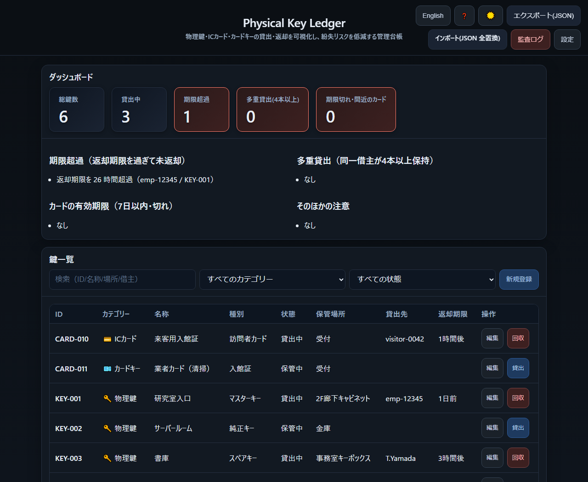
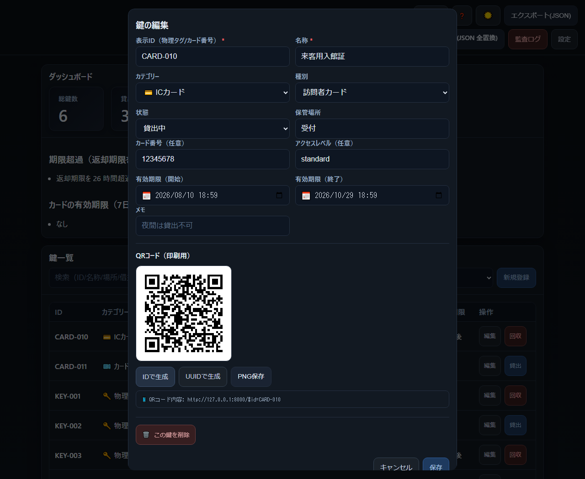
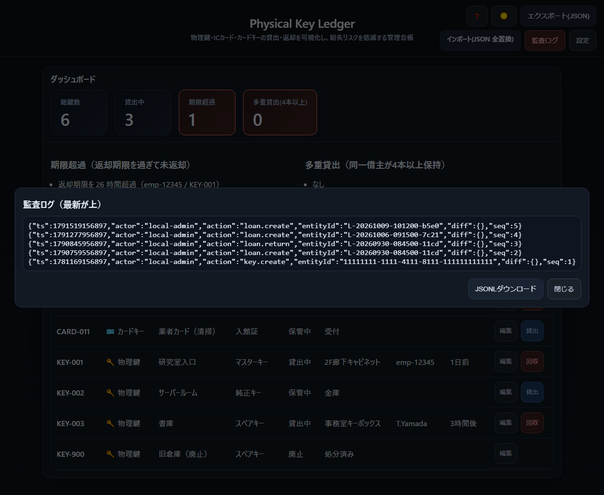
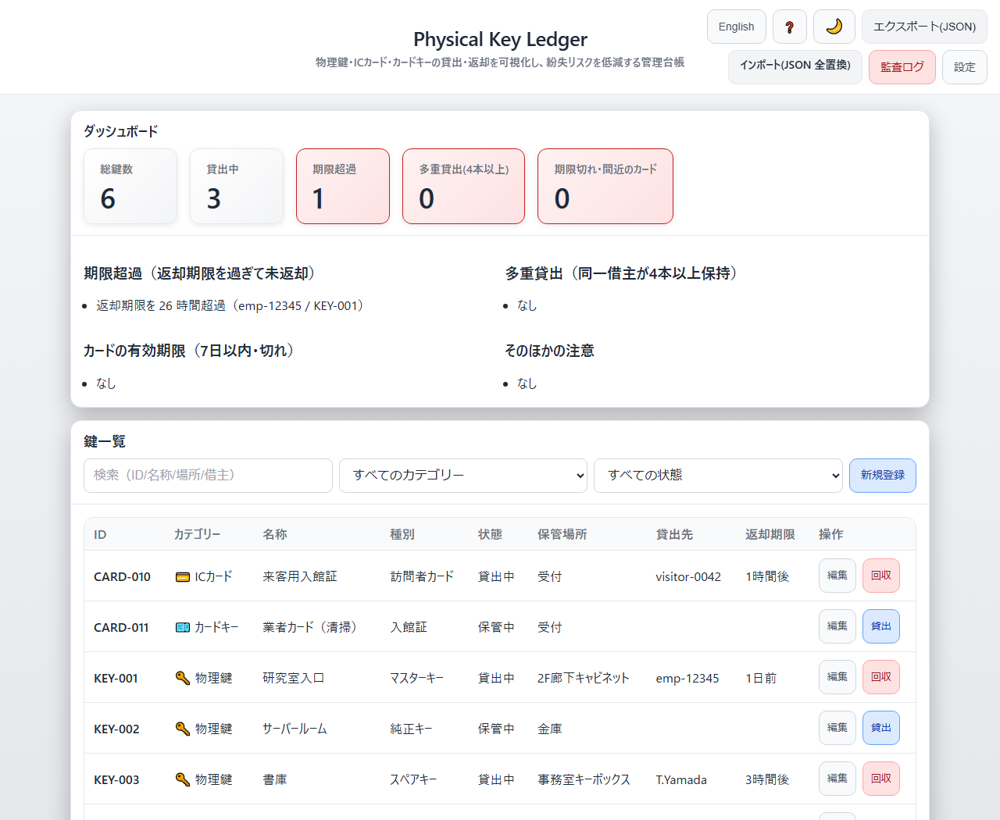

<!--
---
id: day087
slug: physical-key-ledger

title: "Physical Key Ledger"

subtitle_ja: "物理鍵管理台帳"
subtitle_en: "Physical Key Management Ledger"

description_ja: "物理鍵・ICカード・カードキーの貸出・回収を可視化し、紛失リスクを低減するWebアプリ。監査ログ・QRコード連携・アノマリー検知機能を搭載。"
description_en: "Web app to visualize physical key, IC card, and card key loans/returns, reducing loss risk. Features audit logs, QR code integration, and anomaly detection."

category_ja:
  - 物理的セキュリティ
  - 錠前
category_en:
  - Physical Security
  - Lock

difficulty: 2

tags:
  - physical-security
  - key-management
  - audit-log
  - qr-code
  - anomaly-detection
  - indexeddb
  - vanilla-javascript

repo_url: "https://github.com/ipusiron/physical-key-ledger"
demo_url: "https://ipusiron.github.io/physical-key-ledger/"

hub: true
---
-->

# Physical Key Ledger - 物理鍵管理台帳

[English](README.en.md) · 日本語


[](https://ipusiron.github.io/physical-key-ledger/)

**Day087 - 生成AIで作るセキュリティツール100**

**Physical Key Ledger** は、物理鍵・ICカード・カードキーの貸出・回収を可視化し、紛失リスクを低減するためのWebアプリです。

シンプルなUIで「誰が・いつ・どの鍵を利用したか」を即座に把握でき、監査やセキュリティ教育に役立ちます。

物理的な鍵管理の盲点を教育的に示す教材としても、研究室や小規模オフィスでの実務補助としても利用できます。

---

## 🌐 デモページ

👉 **[https://ipusiron.github.io/physical-key-ledger/](https://ipusiron.github.io/physical-key-ledger/)**

ブラウザーで直接お試しいただけます。

---

## 📸 スクリーンショット

>
>*ダッシュボードと鍵一覧。期限を26時間超過した貸出が1件あり、廃止した鍵には貸出ボタンが出ない*

>
>*鍵の編集画面。ICカードではカード番号と有効期限の欄が開き、QRの内容は`#id=`形式になる*

>
>*監査ログ。1件ごとに連番とハッシュが付き、「整合性を検証」で改ざんの有無がわかる*

>
>*ライトテーマ。配色はCSS変数で切り替え、コントラスト比はテストで固定している*

---

## 👥 対象ユーザー

- 研究室・ゼミ管理者: 実験室の鍵や入館カードを学生に貸し出す教員・助手
- 小規模オフィス管理者: 社員証やロッカーキーを管理する総務・事務担当
- シェアオフィス運営者: 会員向けの入館カードや会議室キーを貸し出す受付スタッフ
- 施設管理者: イベント会場・公民館・体育館などで鍵やカードを一時貸出する管理人
- セキュリティ教育担当者: 物理セキュリティの重要性を体験的に教えたい研修講師
- 情報セキュリティ学習者: 物理セキュリティの実践的な管理方法を学びたい学生・初学者
- 個人利用: 自宅や個人事業で複数の鍵・カードを管理したい方

---

## ✨ 特徴

- 🔑 多様な鍵に対応：物理鍵・ICカード・カードキーを統合管理する
- 📋 貸出／回収フロー：誰が・いつ・どの鍵を借りたか、返却したかを記録する
- ⚠️ アノマリー（振る舞い）検知：期限超過・多重保持・有効期限切れのカード・マスターキーの長期貸出・状態と記録の食い違いを警告する
- 📊 ダッシュボード：総鍵数、貸出中、期限超過などを可視化する
- 📝 監査ログ：すべての操作を連番つきで記録し、JSON Linesでエクスポートできる
- 🔗 改ざんの検出：監査ログを直前のハッシュごと封じ、書き換え・削除・挿入・並べ替えを「整合性を検証」で見つける
- 🌐 日英対応：画面の文言を切り替えられる（`?lang=en` でも指定できる）
- 📤 データ入出力：JSONによるエクスポートとインポート（全置換。検証に通らないデータは1件も取り込まない）
- 🏷️ QRコード連携：鍵ごとのQRラベルを生成する。リンクは `#` を使い、鍵のIDをサーバーへ送らない
- 🌓 ライト/ダークモード：手動で切り替えられる。設定はブラウザーに保存する
- 🔒 外部通信なし：CDNを使わず、すべてのファイルを自分のオリジンから読み込む（CSPで固定）

---

## 📖 利用方法

### 基本的な使い方

1. 鍵を登録
   - カテゴリー（物理鍵/ICカード/カードキー）を選択
   - `KEY-001` のような番号で物理タグを付与し、名称・保管場所を入力
   - ICカード・カードキーの場合は、カード番号・アクセスレベル・有効期限も登録可能

2. 貸出登録
   - 借主識別子（社員番号やニックネームなど）と返却期限を入力

3. 回収登録
   - 鍵を返却したらワンクリックでステータス更新

4. アノマリー確認
   - ダッシュボードで期限超過や多重貸出をチェック

5. エクスポート
   - JSON形式でバックアップ。監査ログも追記専用で残る

### QRコードの活用方法

1. QRコード生成
   - 鍵の編集画面で「IDで生成」または「UUIDで生成」ボタンをクリック
   - QRコードが表示され、下部に埋め込まれたURL情報が表示される

2. QRコード印刷
   - 「PNG保存」ボタンでQRコード画像を保存
   - 物理タグやラベルに印刷して鍵に貼付

3. QRコードスキャン
   - スマホのQRコードリーダーでスキャン
   - URLを開くと、その鍵の詳細画面（編集モーダル）が開く
   - 例: `https://example.com/physical-key-ledger/#id=KEY-001`
   - **台帳は端末ごとにブラウザー内へ保存されるため、詳細が開くのは台帳を登録した端末・ブラウザーだけである。**別の端末でスキャンすると「この端末の台帳にありません」と表示される

4. 2種類のQRコード
   - IDで生成: `#id=KEY-001` 形式。タグ番号で検索
   - UUIDで生成: `#key=a1b2c3d4...` 形式。内部IDで検索。タグ番号変更にも対応

鍵の識別子は `#`（フラグメント）に載せている。フラグメントはブラウザーがサーバーへ送らないため、配信元のアクセスログに鍵の表示IDが残らない。読み込んだあとはアドレス欄からも消す（ブラウザーの閲覧履歴には残る）。`?id=` 形式の古いラベルもそのまま読み取れる。

---

## 📋 監査ログ

### 監査ログの意義

本ツールはすべての操作を**監査ログ（Audit Log）**として記録します。

監査ログは以下の目的で活用できます。

- トレーサビリティの確保: 誰が・いつ・何をしたかを追跡可能
- インシデント調査: 鍵の紛失や不正利用の発覚時に操作履歴を遡って分析
- コンプライアンス対応: セキュリティ監査や内部統制の証跡として提出
- 運用改善: 頻繁に貸出される鍵や返却遅延の傾向を分析

### 記録される操作

監査ログには以下の操作が自動記録されます。

| アクション | 説明 | 記録内容 |
|-----------|------|---------|
| `key.create` | 鍵の新規登録 | 鍵のすべてのフィールド（ID、名称、カテゴリーなど） |
| `key.update` | 鍵情報の更新 | 更新後のスナップショット |
| `key.delete` | 鍵の削除 | 削除された鍵のUUID |
| `loan.create` | 貸出登録 | 借主、貸出日時、返却期限、メモ |
| `loan.return` | 鍵の回収 | 返却日時、回収時メモ |
| `import` | データインポート | インポートされた件数（鍵/貸出/ログ） |

各エントリには以下の情報が含まれます。

```json
{
  "ts": 1696320000000,
  "actor": "local-admin",
  "action": "loan.create",
  "entityId": "L-20251003-143000-a1b2",
  "diff": { /* 変更内容のスナップショット */ }
}
```

### 監査ログの活用例

#### 1. インシデント調査

**シナリオ**: 重要な鍵が紛失し、最後に誰が使用したかを調査する

```
手順:
1. 「監査ログ」ボタンをクリック
2. 検索ボックスで鍵ID（例: KEY-005）を検索
3. loan.create と loan.return の履歴を確認
4. 最後に貸出した人物と日時を特定
5. 必要に応じてログをCSV保存して報告書に添付
```

#### 2. セキュリティ監査対応

**シナリオ**: ISO 27001の監査で「物理セキュリティの統制証跡」を求められた

```
手順:
1. 「エクスポート」ボタンでJSONファイルをダウンロード
2. audit フィールドに全操作履歴が含まれている
3. タイムスタンプとアクターで操作者が明確
4. 監査人にJSON（または変換したCSV）を提出
```

#### 3. 運用傾向の分析

**シナリオ**: どの鍵が頻繁に貸出されているかを把握し、予備キーの準備を検討

```
手順:
1. 監査ログをエクスポート
2. action: "loan.create" をフィルター
3. entityId（貸出ID）から keyUuid をグループ化
4. 貸出回数の多い鍵を特定
5. 高頻度の鍵は追加購入や運用見直しを検討
```

#### 4. 不正利用の検出

**シナリオ**: 退職者が退職後も鍵を使用していないか確認

```
手順:
1. 監査ログで actor フィールドを検索（例: actor: "ex-employee-001"）
2. 退職日以降のタイムスタンプがないか確認
3. もし記録があれば、不正アクセスの可能性を調査
```

### 監査ログの保管期間

- ブラウザー内保管: IndexedDBに無期限保存（手動削除しない限り残る）
- 推奨運用: 月次・四半期ごとにエクスポートして外部保管（USB/NAS/クラウドストレージ）
- 長期保管: セキュリティポリシーに従い最低1年間は保管を推奨

### ハッシュチェーンによる改ざんの検出

各エントリーは、直前のエントリーのハッシュを含めて封じています。

```
hash(n) = SHA-256( ts ‖ actor ‖ action ‖ entityId ‖ diff ‖ hash(n-1) )
```

最初のエントリーは `hash(0)` の代わりに、0を64桁並べた値（創世ハッシュ）につながります。「整合性を検証」を押すと全件を計算し直し、合わない位置を報告します。

| 改ざんの手口 | 検出できるか | 何が起きるか |
|---|---|---|
| エントリーの内容を書き換える | できる | そのエントリーのハッシュが合わなくなり、seqで位置を指せる |
| 途中のエントリーを消す | できる | 次のエントリーのprevHashがつながらなくなる |
| 偽のエントリーを割り込ませる | できる | 同上。つながりが切れた位置が出る |
| 並べ替える | できる | 連番の順序か、つながりのどちらかが壊れる |
| 最新のエントリーを消す | できる | 設定ストアに記録した末尾（最後のseqとハッシュ）と食い違う |
| 台帳ごと作り直す | できない | 一貫したチェーンを最初から作り直されると、内部だけでは見抜けない。定期的なエクスポートの外部保管と突き合わせる |

SHA-256は依存パッケージなしで同梱しています（`js/sha256.js`）。NISTのテストベクターとNode.jsの`crypto`との一致をテストで確認しています。

### 監査ログでできること・できないこと

画面から監査ログを編集・削除する手段はなく、エントリーは自動採番の連番（`seq`）で追記されていきます。同じミリ秒に2件書いても、どちらも残ります。

一方で、この台帳はブラウザー内のデータベースに平文で置かれており、認証もありません。次のことはできてしまいます。

- インポートで台帳ごと置き換える（監査ログも置き換わる）
- 開発者ツールやブラウザーの機能でデータベースを直接書き換える

つまり**「改ざんできない」のではなく「画面からは改ざんできない」**です。証跡として使うなら、定期的にエクスポートして外部に保管し、手元のログと突き合わせてください。

- データインポートは監査ログを含めて全置換する。インポート前に必ずエクスポートしておく
- 監査ログには個人識別情報（借主名など）が含まれることがあるため、取り扱いに注意する

---

## 💾 データ構造（例）

### 物理鍵

```json
{
  "id": "KEY-001",
  "uuid": "a1b2c3d4-...",
  "category": "physical-key",
  "name": "研究室入口",
  "type": "original",
  "status": "stored",
  "location": "2F廊下キャビネット",
  "notes": "夜間は貸出不可"
}
```

### ICカード

```json
{
  "id": "CARD-12345",
  "uuid": "e5f6g7h8-...",
  "category": "ic-card",
  "name": "社員証（山田太郎）",
  "type": "employee",
  "status": "loaned",
  "cardNumber": "12345678",
  "accessLevel": "standard",
  "validFrom": 1704067200000,
  "validUntil": 1735689599000,
  "location": "人事部管理",
  "notes": "紛失時は即時報告"
}
```

## 📝 入力項目一覧

### 鍵登録画面の入力項目

| 項目名 | 必須 | 説明 | 入力例 | ヒント |
|--------|------|------|--------|--------|
| 表示ID | ⭐ | 物理タグやカード番号 | `KEY-001`, `CARD-12345` | 半角英数字推奨。QRコードに埋め込まれます |
| 名称 | ⭐ | 鍵・カードの名前 | `研究室入口`, `社員証（山田）` | 日本語OK。用途がわかる名前を推奨 |
| カテゴリー | - | 物理鍵/ICカード/カードキー | `物理鍵` | 選択すると種別が自動で切り替わります |
| 種別 | - | カテゴリーに応じた詳細分類 | `マスターキー`, `社員証` | カテゴリー選択後に表示される選択肢から選択 |
| 状態 | - | 現在の状態 | `保管中`, `貸出中`, `廃止` | 貸出時に自動で「貸出中」に変更されます |
| 保管場所 | - | 鍵の保管場所 | `2F廊下キャビネット` | 保管中の鍵がどこにあるかを記録 |
| メモ | - | 補足情報 | `夜間は貸出不可` | 運用上の注意事項などを自由記述 |

#### カード固有フィールド（ICカード・カードキー選択時のみ表示）

| 項目名 | 必須 | 説明 | 入力例 | ヒント |
|--------|------|------|--------|--------|
| カード番号 | - | カードの物理番号 | `12345678` | カード表面に印字された番号 |
| アクセスレベル | - | 権限レベル | `standard`, `admin` | 管理用の分類に使用 |
| 有効期限（開始） | - | 利用開始日時 | `2024-01-01 09:00` | 📅カレンダーから選択可能 |
| 有効期限（終了） | - | 利用終了日時 | `2024-12-31 23:59` | 📅カレンダーから選択可能 |

### 貸出登録画面の入力項目

| 項目名 | 必須 | 説明 | 入力例 | ヒント |
|--------|------|------|--------|--------|
| 鍵ID | - | 貸し出す鍵のID | `KEY-001` | 自動入力（変更不可） |
| 借主識別子 | ⭐ | 借りる人の識別情報 | `emp-12345`, `T.Yamada` | 社員番号、学籍番号、氏名など |
| 返却期限 | - | いつまでに返却すべきか | `2024-01-15 17:00` | 📅カレンダーから選択可能。期限超過は自動検知 |
| メモ（貸出） | - | 貸出時の特記事項 | `日中点検` | 貸出目的や条件など |

### 回収登録画面の入力項目

| 項目名 | 必須 | 説明 | 入力例 | ヒント |
|--------|------|------|--------|--------|
| 鍵ID | - | 回収する鍵のID | `KEY-001` | 自動入力（変更不可） |
| 借主（参考） | - | 誰から回収したか | `T.Yamada` | 自動入力（参考情報） |
| 返却メモ | - | 回収時の特記事項 | `破損なし` | 鍵の状態などを記録 |

### カテゴリーと種別の対応表

#### 🔑 物理鍵

| 種別 | 説明 | 用途例 |
|------|------|--------|
| マスターキー | すべての錠前を開けられる | ビル管理、施設管理 |
| 純正キー | メーカー製の正規品 | 通常の入退室 |
| スペアキー | 合鍵・予備鍵 | 紛失時のバックアップ |

#### 💳 ICカード

| 種別 | 説明 | 用途例 |
|------|------|--------|
| 社員証 | 従業員向けカード | オフィス入退館 |
| 訪問者カード | 来客用の一時カード | 来客対応 |
| 業者カード | 工事・清掃業者用 | メンテナンス時 |
| 一時カード | 短期利用カード | イベント、研修 |
| その他 | 上記に該当しないカード | 特殊用途 |

#### 🎫 カードキー

| 種別 | 説明 | 用途例 |
|------|------|--------|
| 客室キー | ホテルの部屋用 | 宿泊施設 |
| 入館証 | 建物入館用 | オフィスビル |
| 駐車場カード | 駐車場ゲート開閉用 | 駐車場管理 |
| ロッカーキー | ロッカー開閉用 | 更衣室、保管庫 |
| その他 | 上記に該当しないカード | 特殊用途 |

---

## 🏷️ 物理タグ運用ガイドライン

- タグ番号は半角英数字推奨：`KEY-001`, `CARD-12345`, `LOCKER-A01` など
- カテゴリー選択: 物理鍵・ICカード・カードキーから選択
- 種別の自動切替: カテゴリーに応じて種別オプションが動的に変更
  - 物理鍵: マスターキー/純正キー/スペアキー
  - ICカード: 社員証/訪問者カード/業者カード/一時カード/その他
  - カードキー: 客室キー/入館証/駐車場カード/ロッカーキー/その他
- UUIDは内部識別子：番号が変わっても履歴の一貫性を維持
- 日本語もOK：`name`, `location`, `notes` に利用可能（UTF-8）
- QRコード併用：スマホでスキャンして詳細画面に直接アクセス可能
- カード固有フィールド: ICカード・カードキーではカード番号、アクセスレベル、有効期限を登録可能
- 廃止時はstatus=retiredとして扱う  

---

## 🎯 ユースケース

### このツールならではの使い方

本ツールの中核は「状態（保管中・貸出中・廃止）の遷移」「同時に保持している本数の集計」「期限からの経過時間」「追記されていく操作の記録」です。これらを別の問いに読み替えると、鍵管理以外にも使えます。

- 権限の集中を見る（管理者）：多重貸出のしきい値を1に下げると、いま鍵を持っている人が全員ダッシュボードに並ぶ。下の例（貸出中4件、借主2人）では、しきい値4で0件、3で1件、1で2件と変わる。「誰か1人に鍵が集まっていないか」を、組織図ではなく実際の保持状況で確かめられる
- 単一障害点を探す（施設管理）：マスターキーだけを種別で絞り込むと、「すべての扉を開けられる鍵が、いま何本、誰の手にあるか」が一覧になる。1本しかないマスターキーが長期貸出になっていれば、それが鍵管理の単一障害点である
- 保管の連鎖（chain of custody）の練習（教育・研究）：鍵を「証拠品」「検体」「試薬」に読み替えると、受け渡しの記録そのものが題材になる。借主を「保管責任者」として貸出・回収を繰り返し、監査ログを時系列で読む演習ができる
- 改ざんの検出を体験する（研修）：開発者ツールで監査ログを1件書き換えてから「整合性を検証」を押すと、どのエントリーが変わったかを指し示す。逆に台帳ごと作り直されると検出できない。「電子化すれば改ざんできない」と「改ざんを検出できる」の違いを、言葉ではなく操作で示せる
- 返却の遅れを数える（運用改善）：期限超過は「◯時間超過」で表示される。エクスポートしたJSONの `loans` から `dueAt` と `returnedAt` の差を集計すると、鍵ごと・借主ごとの遅れの傾向が出る。遅れが常態化している鍵は、運用のほうを見直す材料になる
- 貸し借りのある持ち物の管理（暮らし）：工具・カメラ機材・本・自転車の鍵など、「誰かに貸して返ってくるもの」は同じ状態機械で扱える。カテゴリーは3種類だが、メモ欄が自由なので鍵以外の持ち物にも転用できる

多重保持の件数は、しきい値の設定で次のように変わります（貸出中4件、借主Aが3本・借主Bが1本の場合）。

| しきい値 | 多重貸出として出る件数 | 内訳 |
|---|---|---|
| 1 | 2 | A（3本）、B（1本） |
| 2 | 1 | A（3本） |
| 3 | 1 | A（3本） |
| 4 | 0 | なし |

### そのほかの用途

- 研究室や小規模オフィスでの物理鍵・ICカード・カードキーの統合管理
- 教育現場で「鍵管理の盲点」を体験させる教材
- イベント運営や施設管理での一時的な鍵・カード管理
- シェアオフィスでの入館カード・会議室キーの貸出管理
- レッドチームによる物理セキュリティテストの防御側ツール
- 情報セキュリティの授業で、物理セキュリティと監査証跡を扱う回の実習材料
- ほかのツールとの組み合わせ：[Intrusion Path Mapper（Day083）](https://ipusiron.github.io/intrusion-path-mapper/)で描いた侵入経路の「鍵で守られている区間」に、本ツールの貸出状況を当てはめると、机上の経路図が現在の持ち出し状況とつながる

用途を狭めるつもりはありません。ただし、本ツールは認証もデータの暗号化も持ちません。重要施設の鍵の本番管理には向かないので、その線引きだけは守ってください。

---

## 💼 活用シナリオ

### シナリオ1: 大学研究室での鍵・カード統合管理

**背景:**
大学の研究室では、実験室の物理鍵、建物入館用ICカード、ロッカーのカードキーなど、多様なアクセス手段を管理する必要があります。学生の入れ替わりが激しく、「誰が何を持っているか」の把握が困難でした。

**活用方法:**
1. 初期登録: 実験室の鍵3本（マスター1本、スペア2本）、入館ICカード10枚（学生用9枚、来客用1枚）、ロッカーキー5枚を登録
2. QRコード運用: 各鍵・カードにQRラベルを印刷して貼付。学生がスマホでスキャンして即座に貸出登録
3. 期限管理: 学期末に一斉返却期限を設定。期限超過者をダッシュボードで可視化
4. 監査: 卒業時や退学時に、該当学生の貸出履歴を監査ログで確認し、未返却がないかチェック

**効果:**
- 紛失リスク低減（誰が最後に使ったか即座に特定）
- 学生の自主管理意識向上
- 事務作業の削減（紙台帳からの脱却）

---

### シナリオ2: シェアオフィスでの入退館カード管理

**背景:**
シェアオフィスでは、会員向けの入館ICカード、会議室のカードキー、施設内ロッカーの鍵を貸し出しています。複数の管理者が交代で受付業務を行うため、貸出状況の共有が課題でした。

**活用方法:**
1. カテゴリー別登録:
   - ICカード: 正会員用50枚（社員証タイプ）、一時会員用10枚
   - カードキー: 会議室A/B/Cの3枚、ロッカー用20枚
2. 多重貸出検知: しきい値を2に設定し、1人が複数カードを保持していないか監視
3. 有効期限管理: 一時会員カードに1カ月の有効期限を設定し、期限切れを自動検知
4. データエクスポート: 月末に貸出データをJSON出力し、会計システムと連携

**効果:**
- 管理者間での情報共有がスムーズ（ブラウザーベースで端末不問）
- 不正利用の早期発見（多重保持・期限切れの即時アラート）
- 月次レポート作成の自動化

---

### シナリオ3: セキュリティ教育ワークショップでの教材利用

**背景:**
企業の新入社員研修で「物理セキュリティの盲点」を体験的に学ばせたい。座学だけでなく、実際の鍵管理ツールを使って運用の難しさを理解させたい。

**活用方法:**
1. 模擬運用: 研修参加者を5グループに分け、各グループが架空のオフィスの鍵管理を担当
2. インシデント発生: 講師が意図的に「期限超過」「多重貸出」「返却忘れ」などのシナリオを仕込む
3. ダッシュボード監視: 各グループがダッシュボードでアノマリーを検知し、対処法をディスカッション
4. 監査ログ分析: 研修後、監査ログを見ながら「誰がいつミスをしたか」を振り返り、改善策を議論

**活用ポイント:**
- リアルな体験: 実際の鍵管理ツールを使うことで、座学では得られない気づきを提供
- 失敗から学ぶ: 意図的にミスを発生させ、その検知と対処のプロセスを体験
- トレーサビリティの重要性: 監査ログがあることで「誰が何をしたか」を追跡でき、責任の所在が明確になることを実感

**効果:**
- 物理セキュリティの重要性を体感
- インシデント対応力の向上
- 組織のセキュリティ文化醸成

---

### シナリオ4: レッドチームによる物理ペネトレーションテストでの活用

**背景:**
企業のセキュリティ評価において、レッドチームが物理的な侵入経路の脆弱性を検証します。従来の紙ベースの鍵管理台帳では、貸出履歴の改ざんや追跡不能な貸出が発生しており、物理セキュリティの盲点となっていました。

**活用方法:**
1. 事前準備（ブルーチーム側）:
   - すべての物理鍵・ICカード・カードキーをシステムに登録
   - QRコードを各アイテムに貼付し、貸出時の記録を徹底
   - 監査ログを有効化し、全操作を記録
   - 多重貸出しきい値を2に設定（1人が複数アイテムを保持したら警告）

2. レッドチームの攻撃シナリオ:
   - ソーシャルエンジニアリング: 「忘れ物を取りに来た」と偽り、受付でICカードの貸出を依頼
   - テールゲーティング: 正規社員に続いて入館し、ロッカーキーを無断借用
   - 管理者なりすまし: 「緊急メンテナンス」と称してマスターキーの貸出を要求
   - 返却期限の悪用: 長期貸出を申請し、返却期限を過ぎても返却せず、複製の時間を稼ぐ

3. 検知と対処:
   - ダッシュボードで期限超過・多重貸出をリアルタイム検知
   - 監査ログで「誰が・いつ・何を承認したか」を追跡
   - 不審な貸出パターン（短時間での複数貸出、未登録者への貸出）をアラート

4. 報告と改善:
   - レッドチームが監査ログを元に攻撃経路を報告
   - ブルーチームが検知できなかった攻撃を分析し、運用ルールを改善
   - 例: 「緊急貸出は必ず上長承認を必須化」「QRスキャン必須化で人的ミスを削減」

**攻撃パターンと検知例:**

| 攻撃手法 | 従来の紙台帳 | Physical Key Ledger |
|---|---|---|
| 貸出記録の改ざん | 可能（紙の書き換え） | 画面からは不可。ただしインポートの全置換とデータベースの直接操作では書き換えられるため、定期エクスポートの外部保管と併用する |
| 無断借用 | 検知困難 | 検知可能（貸出記録のない持ち出しは、棚卸しで状態と実物が食い違う） |
| 複数アイテム保持 | 把握困難 | 即時検知（多重貸出アラート。しきい値は設定で変えられる） |
| 返却忘れ | 手動チェック必要 | 自動検知（期限超過アラート。返却期限を入れた貸出に限る） |
| 承認者の特定 | 記録なし | 監査ログの `actor` に残る（設定のプロフィール名。認証はないので自己申告である） |

**効果:**
- 物理セキュリティの可視化: 紙台帳では見えなかった脆弱性を数値化
- インシデント対応の迅速化: 監査ログで攻撃経路を即座に特定
- 継続的改善: テスト結果を元に運用ルールをアップデート
- 経営層への報告: ダッシュボードのスクリーンショットで視覚的に説明

**レッドチーム活動での注意点:**
- このツールは防御側（ブルーチーム）の管理ツールであり、攻撃側が悪用するものではありません
- 物理ペネトレーションテストは必ず事前承認を得て、合法的に実施してください
- テスト後は必ず報告書を作成し、改善提案を含めてください

---

## ⚠️ セキュリティとプライバシーに関する重要な注意事項

### データの保存場所と責任

- すべてのデータはブラウザーのIndexedDBにローカル保存されます
  - サーバーには一切送信されません
  - データの管理責任はユーザー自身にあります
  - ブラウザーのキャッシュクリアでデータが消失する可能性があります

### 公開環境での利用について

このツールは **デモ・教育・個人利用を想定** しています。本番環境での重要なセキュリティ資産の管理には **適していません**。

**推奨される使い方:**
- ✅ セキュリティ教育のワークショップ（模擬データ）
- ✅ 個人の鍵管理（自己責任）
- ✅ 小規模オフィスでの試験運用（重要度の低い鍵のみ）
- ✅ レッドチーム演習の防御側ツール（テストデータ）

**避けるべき使い方:**
- ❌ 企業の重要インフラへのアクセス鍵の管理
- ❌ 機密施設のマスターキー管理
- ❌ 複数人が共有するパブリックPC上での本番運用
- ❌ 個人情報を含むカード情報の本番管理

### GitHub Pagesでの公開に関する注意

- このデモページは **教育・デモ目的** で公開されています
- 本番データを入力しないでください（すべてブラウザー内に保存されますが、誤操作のリスクがあります）
- 入力したデータは配信元のサーバーへは送られません。QRコードのリンクも `#`（フラグメント）を使うため、鍵の表示IDがアクセスログに残りません
- 機密性の高いデータを扱う場合は、自分のローカル環境やプライベートサーバーで運用してください

### セキュリティベストプラクティス

1. 定期バックアップ: エクスポート機能で定期的にJSONバックアップを取得
2. ブラウザーの管理: 信頼できる端末・ブラウザーでのみ利用
3. データの暗号化: 重要データは外部で暗号化してから保存
4. アクセス制御: 共有PCでは利用後に必ずログアウト（ブラウザーを閉じる）
5. 監査ログの活用: 不審な操作がないか定期的に確認

---

## ⚙️ 制約

- データは **ブラウザーごとに保存** され、他端末とは自動同期しません
- インポートは **全置換のみ**（マージ不可）
- PWA／通知連携／多ユーザー権限は将来拡張予定
- QRコード生成は可能ですが、専用のスキャナーアプリではなく汎用QRリーダーでの読み取りを前提としています
- 認証機能なし: 誰でもブラウザーにアクセスできればデータを閲覧・編集可能
- データ暗号化なし: IndexedDB内のデータは平文で保存されます
- 監査ログの改ざんは**検出**できますが、**阻止**はできません（上の表を参照）
- 画面の言語は日本語と英語のみ

---

## 📁 ディレクトリー構造

```
physical-key-ledger/
├── .github/                      # GitHub の設定
│   └── workflows/                # GitHub Actions のワークフロー
│       └── test.yml              # push と pull_request で npm test を走らせる
├── assets/                       # READMEから参照する画像
│   ├── en/                       # 英語表示のスクリーンショット
│   │   ├── screenshot.png        # ダッシュボードと鍵一覧（ダーク）
│   │   ├── screenshot2.png       # 鍵の編集画面とQRコード
│   │   ├── screenshot3.png       # 監査ログ
│   │   └── screenshot4.png       # ダッシュボードと鍵一覧（ライト）
│   ├── screenshot.png            # ダッシュボードと鍵一覧（ダーク）
│   ├── screenshot2.png           # 鍵の編集画面とQRコード
│   ├── screenshot3.png           # 監査ログ
│   └── screenshot4.png           # ダッシュボードと鍵一覧（ライト）
├── css/                          # スタイルシート
│   └── style.css                 # 配色（CSS変数）・レイアウト・ライト/ダーク
├── js/                           # アプリケーション本体（ES Modules）
│   ├── anomaly.js                # 異常検知とKPIの計算（DOM非依存の純粋関数）
│   ├── audit-chain.js            # 監査ログのハッシュチェーンと検証（純粋関数）
│   ├── db.js                     # IndexedDB（スキーマv3、鍵・貸出・監査ログ・設定）
│   ├── display.js                # ラベル・相対時間・日時入力の変換（純粋関数）
│   ├── i18n.js                   # 言語の選択と画面の差し替え
│   ├── logic.js                  # 台帳の操作（登録・貸出・回収・入出力・設定）
│   ├── messages.js               # 日本語と英語の文言（画面・エラー・ヘルプ）
│   ├── sha256.js                 # SHA-256の実装（依存なし・同期）
│   ├── ui.js                     # 画面の組み立てとイベント処理
│   └── validate.js               # インポートとフォーム入力の検査（純粋関数）
├── test/                         # 自動テスト（node:test、依存なし）
│   ├── anomaly.test.js           # 異常検知とKPIの期待値
│   ├── audit-chain.test.js       # 改ざん・削除・挿入・末尾切りの検出
│   ├── contrast.test.js          # 配色のコントラスト比と操作要素の寸法
│   ├── display.test.js           # ラベル・相対時間・日時の往復
│   ├── format.test.js            # ソースの行長・行数・不可視文字
│   ├── html.test.js              # CSP・インライン属性・aria・主要なid
│   ├── i18n.test.js              # 日英の辞書の整合と言語の選び方
│   ├── readme.test.js            # READMEの表・ツリー・画像参照・表記
│   ├── sha256.test.js            # NISTのテストベクターとnode:cryptoとの一致
│   └── validate.test.js          # 不正なインポートデータの拒否
├── vendor/                       # 同梱した外部ライブラリー
│   ├── LICENSE-qrcodejs.txt      # QRCode.js のライセンス（MIT）
│   ├── README.md                 # 出所・バージョン・SHA-256・SRI
│   └── qrcode.min.js             # QRCode.js 1.0.0（改変なし）
├── .gitignore                    # Git の除外設定
├── .nojekyll                     # GitHub Pages で Jekyll 処理を止める
├── CLAUDE.md                     # 開発メモ（Claude Code用）
├── LICENSE                       # MITライセンス
├── README.en.md                  # 英語版のREADME
├── README.md                     # このファイル
├── TECHNICAL.md                  # 技術ドキュメント（開発者向け）
├── index.html                    # 画面の構造（CSP・モーダル・ヘルプ）
└── package.json                  # npm test の定義（依存パッケージなし）
```

### 主要ファイルの役割

- index.html: CSP・モーダル・ヘルプを含む画面の構造
- db.js: IndexedDB v3のスキーマと、鍵・貸出・監査ログをまとめて書くトランザクション
- logic.js: 鍵の登録・貸出・回収・入出力。計算は純粋モジュールに委ねる
- anomaly.js / display.js / validate.js: DOMに触らない計算部。`npm test` が直接読む
- ui.js: 表とダッシュボードの描画、QRコード生成、スキャンしたリンクの処理
- style.css: CSS変数によるテーマ切り替えとレスポンシブ対応
- TECHNICAL.md: アーキテクチャ設計、コアアルゴリズム、実装詳細（[詳細はこちら](TECHNICAL.md)）

---

## 🧪 テスト

ロジックはDOMに触らない純粋モジュール（`js/anomaly.js`・`js/display.js`・`js/validate.js`）に分けてあり、Node.jsの標準テストランナーだけで検証できます。依存パッケージはありません。

```bash
npm test     # node --test
```

- Node.js 22以上が必要です（`node:test` と `node:assert/strict` を使用）
- `.github/workflows/test.yml` により、pushとpull requestで自動実行されます
- READMEの表や例の数値も `test/readme.test.js` が計算し直して照合します

| テスト | 検証する内容 |
|---|---|
| `test/anomaly.test.js` | 期限超過・多重保持・期限切れカード・マスターキーの長期貸出・状態の食い違い・KPI |
| `test/audit-chain.test.js` | 監査ログの改ざん・削除・挿入・並べ替え・末尾切りの検出 |
| `test/contrast.test.js` | ライト/ダーク/既定の配色のコントラスト比、操作要素の寸法 |
| `test/display.test.js` | ラベル変換、相対時間の境界、日時入力の往復と不正値の拒否 |
| `test/format.test.js` | ソースの行長・行数・不可視文字の混入 |
| `test/html.test.js` | CSPの指令、インライン属性の不在、スクリプトの出所、aria、主要なid |
| `test/i18n.test.js` | 日英の辞書のキー整合・差し込み・タグ数、言語の選び方 |
| `test/readme.test.js` | READMEの表・ディレクトリー構造・画像参照・表記 |
| `test/sha256.test.js` | SHA-256の実装（NISTのテストベクター、node:cryptoとの突き合わせ） |
| `test/validate.test.js` | 不正なインポートデータの拒否（UUID形式・一意性・型） |

---

## 💻 動作環境

- モダンブラウザー（Chrome・Edge・Firefox・Safariの最新版）
- JavaScriptとIndexedDBが使えること
- インターネット接続は不要です（外部CDNを使わず、QRCode.jsも同梱しています）

ローカルで動かす場合は、HTTPで配信してください。`index.html` をダブルクリックして `file://` で開くと、ES Modulesがブラウザーの制限で読み込めず、画面が空のまま動きません。

```bash
cd physical-key-ledger
python -m http.server 8000
# ブラウザーで http://localhost:8000/ を開く
```

---

## 📄 ライセンス

MIT License – 詳細は [LICENSE](LICENSE) を参照してください。

QRコードの生成には [QRCode.js](https://github.com/davidshimjs/qrcodejs)（MIT License, Copyright (c) 2012 davidshimjs）を同梱しています。出所とハッシュは [vendor/README.md](vendor/README.md) を参照してください。

---

## 🛠️ このツールについて

本ツールは、「生成AIで作るセキュリティツール100」プロジェクトの一環として開発されました。
このプロジェクトでは、AIの支援を活用しながら、セキュリティに関連するさまざまなツールを100日間にわたり制作・公開していく取り組みを行っています。

プロジェクトの詳細や他のツールについては、以下のページをご覧ください。

🔗 [https://akademeia.info/?page_id=42163](https://akademeia.info/?page_id=42163)
