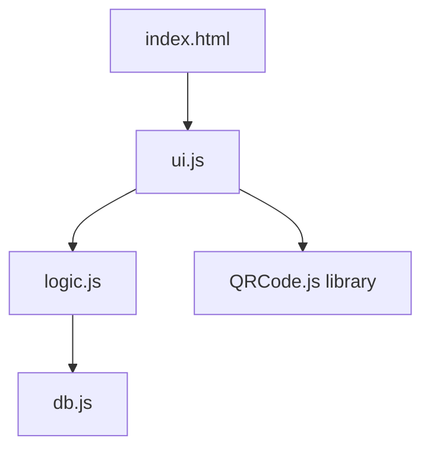

# 🔧 技術ドキュメント

Physical Key Ledger の技術的な実装詳細、アーキテクチャ、コアアルゴリズムを解説します。

---

## 📐 アーキテクチャ設計

### レイヤー構成

本ツールは **3層アーキテクチャ** を採用しています：

```
┌─────────────────────────────────────┐
│  UI Layer (ui.js)                   │  ← イベントハンドリング、DOM操作
├─────────────────────────────────────┤
│  Logic Layer (logic.js)             │  ← ビジネスロジック、状態管理
├─────────────────────────────────────┤
│  Data Layer (db.js)                 │  ← IndexedDB 薄層ラッパー
└─────────────────────────────────────┘
```

**設計思想**:
- 各層の責務を明確に分離
- 上位層は下位層のみに依存（循環依存なし）
- データ層は純粋な CRUD 操作のみを提供
- ビジネスロジックはロジック層に集約

---

## 🗄️ IndexedDB スキーマ設計

### DB バージョン管理

```javascript
export const DB_VERSION = 3;
```

**マイグレーション戦略**:
- `onupgradeneeded` イベントで段階的スキーマ更新
- 既存データを保持しながらインデックス追加
- v1 → v2: マルチカテゴリー対応（category, cardNumber, validUntil インデックス追加）
- v2 → v3: 監査ストアの主キーをタイムスタンプから自動採番の `seq` へ変更し、`ts` はインデックスに移す。既存のエントリーはts順に積み直す

### ストア構造

#### 1. `keys` ストア（鍵マスタ）

```javascript
keyPath: "uuid"
```

**インデックス一覧**:

| インデックス名 | フィールド | unique | 用途 |
|----------------|------------|--------|------|
| by_id | id | ✓ | 表示ID による一意検索 |
| by_status | status | - | ステータス別フィルター |
| by_name | name | - | 名称検索 |
| by_category | category | - | カテゴリー別フィルター |
| by_cardNumber | cardNumber | - | カード番号検索 |
| by_validUntil | validUntil | - | 有効期限ソート |

**設計ポイント**:
- `uuid` をプライマリキーとして内部で一意性を保証
- `id` は人間可読な表示ID（KEY-001など）で外部公開用
- マルチカテゴリー対応のため category インデックスを追加（v2）

#### 2. `loans` ストア（貸出履歴）

```javascript
keyPath: "loanId"
```

**インデックス一覧**:

| インデックス名 | フィールド | 用途 |
|----------------|------------|------|
| by_keyUuid | keyUuid | 特定鍵の貸出履歴取得 |
| by_borrower | borrower | 借主別の貸出一覧 |
| by_active | returnedAt | アクティブな貸出検索（null値） |
| by_dueAt | dueAt | 期限切れ検出用 |

**設計ポイント**:
- `returnedAt` が `null` の場合は「貸出中」を意味
- `by_active` インデックスで `returnedAt == null` を高速検索
- 履歴は論理削除（物理削除しない）

#### 3. `audit` ストア（監査ログ）

```javascript
keyPath: "seq", autoIncrement: true  // 追記順の連番
```

**インデックス一覧**:

| インデックス名 | フィールド | 用途 |
|----------------|------------|------|
| by_ts | ts | 期間で絞り込む用途（将来用） |

**設計ポイント**:
- 連番を主キーにして追記順を保証する。タイムスタンプを主キーにすると、同じミリ秒に書いた2件目が1件目を上書きして消える
- カーソルを `prev` 方向に走査すると降順で取得できる
- すべての変更操作（CRUD）を記録する

#### 4. `meta` ストア（設定）

```javascript
keyPath: "key"
```

**格納データ**:
- `profileName`: 操作者名
- `multiThreshold`: 多重保持警告しきい値

---

## 🧠 コアアルゴリズム

### 1. UUID 生成（RFC 4122 類似）

```javascript
export function genUuid() {
  return ([1e7]+-1e3+-4e3+-8e3+-1e11)
    .replace(/[018]/g, c =>
      (c ^ crypto.getRandomValues(new Uint8Array(1))[0] & 15 >> c / 4).toString(16)
    );
}
```

**解説**:
- UUID v4 形式の簡易実装
- `crypto.getRandomValues()` で暗号学的に安全な乱数生成
- テンプレート `xxxxxxxx-xxxx-4xxx-yxxx-xxxxxxxxxxxx` に従う
- ビット演算で高速化

**なぜ `crypto.randomUUID()` を使わないか？**
- ブラウザー互換性を考慮（古いブラウザー対応）
- 軽量実装で依存ライブラリーなし

### 2. 貸出ID 生成（タイムスタンプベース）

```javascript
export function genLoanId(date = new Date()) {
  const pad = (n) => String(n).padStart(2, "0");
  const day = `${date.getFullYear()}${pad(date.getMonth() + 1)}${pad(date.getDate())}`;
  const time = `${pad(date.getHours())}${pad(date.getMinutes())}${pad(date.getSeconds())}`;
  const rnd = [...crypto.getRandomValues(new Uint8Array(2))]
    .map((b) => b.toString(16).padStart(2, "0")).join("");
  return `L-${day}-${time}-${rnd}`;
}
```

**フォーマット**: `L-YYYYMMDD-HHMMSS-xxxx`

**設計理由**:
- 時系列ソート可能な ID
- 衝突回避のため末尾にランダム文字列（base36）
- 人間可読性を維持

### 3. 期限切れ検出アルゴリズム

```javascript
export function detectOverdue() {
  const now = nowMs();
  const list = [];
  for (const L of state.cache.loans) {
    if (L.returnedAt == null && L.dueAt && now > L.dueAt) {
      list.push(L);
    }
  }
  return list;
}
```

**条件**:
1. `returnedAt == null` → 未返却
2. `dueAt` が設定されている
3. `now > dueAt` → 期限超過

**最適化**:
- メモリーキャッシュ（`state.cache.loans`）で高速スキャン
- IndexedDB への問い合わせを最小化

### 4. 多重保持検出アルゴリズム

```javascript
export function detectMultiHolding() {
  const map = new Map();
  for (const L of state.cache.loans) {
    if (L.returnedAt == null) {
      if (!map.has(L.borrower)) map.set(L.borrower, 0);
      map.set(L.borrower, map.get(L.borrower) + 1);
    }
  }
  const out = [];
  for (const [borrower, count] of map.entries()) {
    if (count >= state.settings.multiThreshold) out.push({ borrower, count });
  }
  return out;
}
```

**アルゴリズム**:
1. アクティブな貸出のみをフィルター（`returnedAt == null`）
2. `Map` で借主ごとの保持数をカウント
3. しきい値以上の借主を抽出

**計算量**: O(n) - ローン数に比例

---

## 🚀 パフォーマンス最適化

### キャッシュ戦略

```javascript
export const state = {
  db: null,
  cache: {
    keys: [],
    loans: [],
  },
  // ...
};
```

**設計**:
- すべての鍵・貸出データをメモリーにキャッシュ
- CRUD 操作後に `refreshCache()` で同期
- 読み取り操作は IndexedDB にアクセスせず

**トレードオフ**:
- ✅ 高速な検索・フィルタリング
- ⚠️ 大量データ時のメモリー使用量増加（数千件まで想定）

### 並列データ取得

```javascript
export async function refreshCache() {
  const [keys, loans] = await Promise.all([
    dbApi.getAllKeys(state.db),
    dbApi.getAllLoans(state.db),
  ]);
  state.cache.keys = keys;
  state.cache.loans = loans;
}
```

**最適化**:
- `Promise.all()` で keys と loans を並列取得
- 直列取得に比べて約 2 倍高速

---

## 🔐 トランザクション設計

### ヘルパー関数

```javascript
function tx(db, mode, ...stores) {
  const t = db.transaction(stores, mode);
  const m = {};
  for (const name of stores) m[name] = t.objectStore(name);
  return { t, ...m };
}
```

**使用例**:
```javascript
const { t, keys, loans } = tx(db, "readwrite", "keys", "loans");
keys.put(keyObj);
loans.put(loanObj);
t.oncomplete = () => resolve(true);
```

**利点**:
- 複数ストアへのアトミックな書き込み
- ボイラープレート削減
- トランザクション境界の明確化

### ACID 保証

**貸出操作の例**:
```javascript
export async function createLoan({ keyUuid, borrower, dueAt, outNotes }) {
  // 1. バリデーション
  const key = state.cache.keys.find(k => k.uuid === keyUuid);
  if (!key) throw new Error("鍵が存在しません。");
  if (key.status === "loaned") throw new Error("この鍵は既に貸出中です。");

  // 2. トランザクション内で複数操作
  // keys / loans / audit を1つの readwrite トランザクションで書く
  await dbApi.createLoanAtomic(state.db, { keyObj, loan, auditDraft }, sealAudit);

  // 3. キャッシュ同期
  await refreshCache();
}
```

**保証**:
- 3つのストアへの書き込みがすべて成功するか、すべて失敗するか（原子性）
- 途中で失敗するとIndexedDBがトランザクションごと巻き戻すため、「状態は貸出中なのに貸出レコードがない」状態は残らない

---

## 🎨 テーマシステム

### ダークモード優先設計

```javascript
// デフォルトはダークテーマ
state.theme = "dark";

// システム設定を検出
const prefersDark = window.matchMedia("(prefers-color-scheme: dark)").matches;
state.theme = prefersDark ? "dark" : "light";
```

**CSS カスタムプロパティー**:
```css
body[data-theme="dark"] {
  --bg: #0b0f14;
  --card: #121922;
  --text: #e7eef7;
}
body[data-theme="light"] {
  --bg: #f5f7fa;
  --card: #ffffff;
  --text: #1f2937;
}
```

**設計理由**:
- セキュリティーツールは暗い環境での利用が多い
- 目の疲労軽減
- `prefers-color-scheme` でOS設定を尊重

---

## 📊 KPI 計算の最適化

```javascript
export function kpi() {
  const total = state.cache.keys.length;
  const loaned = state.cache.keys.filter(k => k.status === "loaned").length;
  const overdue = detectOverdue().length;
  const multi = detectMultiHolding().length;
  return { total, loaned, overdue, multi };
}
```

**計算量**:
- `total`: O(1)
- `loaned`: O(n) - keys の長さ
- `overdue`: O(m) - loans の長さ
- `multi`: O(m)

**合計**: O(n + m) - 線形時間

**リアルタイム更新**:
- CRUD 操作後に UI が `kpi()` を呼び出し
- キャッシュベースなので高速（IndexedDB アクセスなし）

---

## 🔄 インポート/エクスポート

### フルダンプ方式

```javascript
export async function exportAll(db) {
  const [keys, loans, audit] = await Promise.all([
    this.getAllKeys(db),
    this.getAllLoans(db),
    this.getAllAuditDesc(db, 100000),
  ]);
  return { keys, loans, audit };
}
```

**特徴**:
- 監査ログを含むすべてのデータを並列取得
- JSON 形式でエクスポート（可読性・可搬性）
- ファイル名にタイムスタンプを含む（例: `pkledger-export-20251003.json`）

### 全置換インポート

```javascript
export async function importAllReplace(db, dataset) {
  const t = db.transaction(["keys", "loans", "audit"], "readwrite");
  const sk = t.objectStore("keys");
  const sl = t.objectStore("loans");
  const sa = t.objectStore("audit");

  // 既存データを削除
  sk.clear(); sl.clear(); sa.clear();

  // 新データを挿入
  (dataset.keys || []).forEach((k) => sk.put(k));
  (dataset.loans || []).forEach((l) => sl.put(l));
  (dataset.audit || []).forEach((a) => sa.put(a));

  t.oncomplete = () => resolve(true);
}
```

**設計判断**:
- **全置換方式** を採用（マージではない）
- 理由: シンプルで予測可能な動作
- 単一トランザクションでアトミック性を保証

---

## 🔍 検索・フィルタリング実装

### クライアントサイドフィルタリング

```javascript
// ui.js の keyMatchesFilter（実コード）
function keyMatchesFilter(k, txt, category, status) {
  const activeLoan = state.cache.loans.find(L => L.keyUuid === k.uuid && L.returnedAt == null);
  const borrower = activeLoan?.borrower || "";
  if (category && (k.category || "physical-key") !== category) return false;
  if (status && k.status !== status) return false;
  if (!txt) return true;
  const hay = (k.id + " " + k.name + " " + (k.location || "") + " " + borrower).toLowerCase();
  return hay.includes(txt.toLowerCase());
}
```

**アプローチ**:
- IndexedDB のインデックスではなく JavaScript で実装
- 理由: 複数条件の AND/OR を柔軟に処理可能
- キャッシュベースなので高速

---

## 🧩 モジュール依存関係


```mermaid
graph TD
  A[index.html] --> B[ui.js]
  B --> C[logic.js]
  C --> D[db.js]
  B --> E[QRCode.js library]
```

**依存方向**:
- 上位から下位への単方向依存
- 循環依存なし
- 各モジュールは独立してテスト可能

---

## 🛡️ エラーハンドリング戦略

### ビジネスロジックレベル

```javascript
export async function deleteKey(uuid) {
  // 防御的プログラミング
  const active = await dbApi.getActiveLoanByKey(state.db, uuid);
  if (active) throw new Error("貸出中のため削除できません。先に回収してください。");

  await dbApi.deleteKey(state.db, uuid);
}
```

**設計**:
- 不正な操作を早期に検出
- 具体的なエラーメッセージをユーザーに提示
- データ整合性を保護

### UI レベル

```javascript
try {
  await createLoan({ keyUuid: uuid, borrower, dueAt, outNotes });
  els.dlgLoan.close();
  await rerenderAll();
} catch (err) {
  alert(err.message || String(err));
}
```

**パターン**:
- すべての非同期操作を try-catch でラップする
- 失敗したときはモーダルを閉じず、`alert` で理由を出す（検証エラーは複数行で返る）

---

## 🌐 QR コード深層リンク

### URL パラメーター処理

```javascript
// 鍵の識別子はフラグメントに載せる。サーバーへ送られないので、
// 配信元のアクセスログに鍵のIDが残らない
function readDeepLink() {
  const url = new URL(location.href);
  const hash = new URLSearchParams(url.hash.replace(/^#/, ""));
  return {
    id: hash.get("id") ?? url.searchParams.get("id"),
    key: hash.get("key") ?? url.searchParams.get("key"),
    hasQuery: url.search.length > 0 || url.hash.length > 0
  };
}
```

**対応パラメーター**:
- `#id=KEY-001` → 表示IDで検索
- `#key=uuid-string` → UUIDで検索（内部用）
- `?id=` と `?key=` も読み取る（既存のラベルとの互換）。読み取ったあとは `history.replaceState` でURLから消す

**使用例**:
1. QR コード生成時に URL を埋め込み
2. スマートフォンで QR スキャン
3. ブラウザーが開き、自動的に鍵詳細画面を表示

---

## 📱 レスポンシブ対応

### ブレークポイント戦略

```css
@media (max-width: 760px) {
  .grid-2 { grid-template-columns: 1fr; }
  .modal { min-width: 92vw; }
  .app-header { grid-template-columns: 1fr auto; }
}
```

**設計**:
- 760px を境界にモバイル/デスクトップ切り替え
- テーブルは水平スクロール可能に
- モーダルは画面サイズに追従

---

## 🔧 開発時の注意点

### 1. IndexedDB のデバッグ

**Chrome DevTools**:
1. `F12` → `Application` タブ
2. `Storage` → `IndexedDB` → `physical-key-ledger`
3. 各ストアとインデックスを確認可能

### 2. キャッシュクリア

```javascript
// 強制的にキャッシュを再読み込み
await refreshCache();
```

### 3. スキーマ変更時

- `DB_VERSION` をインクリメント
- `onupgradeneeded` に移行コードを追加
- 既存データとの互換性を考慮

---

## 📦 外部依存ライブラリー

| ライブラリー | バージョン | 用途 | 配置 |
|---|---|---|---|
| QRCode.js | 1.0.0 | QRコード生成 | `vendor/qrcode.min.js`（自己ホスト） |

**最小限の依存**:
- npmの依存パッケージはゼロ（`package.json` は `npm test` の定義だけ）
- バンドラー不要（ES Modulesで直接実行）
- フレームワークレス（Vanilla JS）
- 外部CDNを使わない。CDNが差し替えられた場合に台帳のデータを読まれる経路を残さないため、
  実ファイルを同梱し、出所とSHA-256を `vendor/README.md` に記録している

---

## 🔗 監査ログのハッシュチェーン

### 連鎖の作り方

各エントリーは、直前のエントリーのハッシュを含めて封じる。

```javascript
// js/audit-chain.js
export function sealEntry(draft, prevEntry) {
  const prevHash = prevEntry && HASH_RE.test(String(prevEntry.hash || ""))
    ? prevEntry.hash
    : GENESIS;                       // 最初は0を64桁
  const entry = { ...draft, prevHash };
  entry.hash = entryHash(entry, prevHash);
  return entry;
}
```

ハッシュの対象は `ts`・`actor`・`action`・`entityId`・`diff`・`prevHash` の6つである。

**`seq` を対象に含めない理由**: 連番はIndexedDBが `add()` の完了後に割り当てる。ハッシュを計算する時点ではまだ決まっていない。順序の検証は、連番そのものと `prevHash` のつながりの両方で行う。

### 同じ内容なら同じ文字列にする

エクスポートとインポートを通してもハッシュが変わらないよう、キーの順序を固定したJSONを作る。

```javascript
export function stableStringify(value) {
  if (value === null || typeof value !== "object") return JSON.stringify(value ?? null);
  if (Array.isArray(value)) return `[${value.map(stableStringify).join(",")}]`;
  const keys = Object.keys(value).filter((k) => value[k] !== undefined).sort();
  return `{${keys.map((k) => `${JSON.stringify(k)}:${stableStringify(value[k])}`).join(",")}}`;
}
```

### トランザクションの中で封じる

Web Cryptoの `crypto.subtle.digest` は非同期で、IndexedDBのトランザクションはPromiseを待てない（待つ間に自動で閉じる）。そのため **SHA-256を同期の自前実装（`js/sha256.js`）で持つ**。

```javascript
// js/db.js
export function appendAuditInTx(auditStore, metaStore, draft, seal) {
  auditStore.openCursor(null, "prev").onsuccess = (e) => {
    const prev = e.target.result ? e.target.result.value : null;
    const entry = seal ? seal(draft, prev) : draft;      // ここで同期的にハッシュを計算
    const req = auditStore.add(entry);
    if (metaStore && entry.hash) {
      req.onsuccess = (ev) => {
        metaStore.put({ key: CHAIN_HEAD_KEY, value: { seq: ev.target.result, hash: entry.hash } });
      };
    }
  };
}
```

### 末尾切りへの対処

チェーンの末尾を削ると、残った部分は整合して見える。そこで**最後のseqとハッシュを `meta` ストアに同じトランザクションで記録**し、検証時に突き合わせる。記録側も書き換えられれば破られるが、触る場所が増えるぶん痕跡も増える。

### 検証できることとできないこと

| 手口 | 検出 | 理由 |
|---|---|---|
| 内容の書き換え | できる | 再計算したハッシュが合わない |
| 途中の削除・挿入 | できる | 次のエントリーの `prevHash` がつながらない |
| 並べ替え | できる | 連番の順序かつながりが壊れる |
| 末尾の切り落とし | できる | 記録してある末尾と食い違う |
| 台帳ごと作り直す | できない | 一貫したチェーンを作られると内部だけでは見抜けない |

---

## 🌐 日英対応

### 構成

| ファイル | 役割 |
|---|---|
| `js/messages.js` | 日英の辞書（画面・エラー・ヘルプ。各198キー） |
| `js/i18n.js` | 言語の決定、`data-i18n` の差し替え、`{n}` の差し込み |

### 言語の決定

```javascript
export function pickLang({ urlLang, savedLang, browserLang } = {}) {
  if (isLang(urlLang)) return urlLang;        // ?lang=en
  if (isLang(savedLang)) return savedLang;    // localStorage
  const b = String(browserLang || "").toLowerCase();
  if (b.startsWith("ja")) return "ja";
  if (b) return "en";                          // 日本語以外は英語
  return DEFAULT_LANG;
}
```

### 差し替えの3形

- `data-i18n="key"` → `textContent`
- `data-i18n-html="key"` → `innerHTML`（辞書の中の文字列だけ。利用者の入力は通さない）
- `data-i18n-attr="placeholder:key,title:key2"` → 属性

HTMLには日本語を既定値として残す。JavaScriptが動かないときに表示されるのはこれで、動くときは必ず辞書で上書きされる。

### 切り替えのときに再計算しない

言語を変えても台帳の計算はやり直さない。キャッシュの値をそのまま描き直す。入力中の値・開いているモーダル・生成済みのQRコードも維持する。

---

## 🧪 テスト

ロジックはDOMに触らない純粋モジュールに切り出してあり、Node.jsの標準テストランナーだけで回せる。依存パッケージはない。

```bash
npm test   # node --test（Node.js 22以上）
```

### 構成

| ファイル | 対象 |
|---|---|
| `test/anomaly.test.js` | 期限超過・多重保持・期限切れカード・マスターキーの長期貸出・状態の食い違い・KPI |
| `test/contrast.test.js` | CSS変数の配色のコントラスト比（ライト/ダーク/既定）と操作要素の寸法 |
| `test/display.test.js` | ラベル変換・相対時間の境界・日時入力の往復と不正値の拒否 |
| `test/format.test.js` | ソースの行長・行数・不可視文字の混入 |
| `test/html.test.js` | CSPの指令・インライン属性の不在・スクリプトの出所・aria・主要なid |
| `test/readme.test.js` | READMEの表の数値・ディレクトリー構造・画像参照・表記 |
| `test/audit-chain.test.js` | 改ざん・削除・挿入・並べ替え・末尾切り・旧形式の混在 |
| `test/i18n.test.js` | 日英の辞書の整合・差し込み・タグ数・参照キーの実在 |
| `test/sha256.test.js` | NISTのテストベクター・node:cryptoとの一致・UTF-8の変換 |
| `test/validate.test.js` | 不正なインポートデータの拒否（UUID形式・一意性・型） |

### 方針

- 期待値は実装を動かして確かめてから書く。テストに「こうなってほしい値」を書かない
- 時刻に依存する関数は `now` を引数で受け取り、実行する時間帯やタイムゾーンで結果が変わらないようにする
- READMEに書いた数値は `test/readme.test.js` が計算し直して照合する

### 画面の確認

画面まわり（CSP違反の有無・モーダル・QRコード・横あふれ・タップ領域）はPlaywrightで確認する。
使い捨てのスクリプトはリポジトリーには置かない。

---

## 🚧 今後の拡張可能性

### 1. マルチユーザー対応

- Firebase Firestore / Supabase との連携
- リアルタイム同期
- 権限管理（閲覧者/編集者/管理者）

### 2. 通知機能

- 期限切れ時のメール/Slack 通知
- Push API でブラウザー通知

### 3. 統計・レポート

- 貸出頻度のヒートマップ
- 借主別の利用統計
- CSV エクスポート機能

### 4. バーコードスキャナー対応

- カメラ API で物理バーコード読み取り
- 鍵の実物とデータを紐付け

---

## 📚 参考資料

- [IndexedDB API - MDN](https://developer.mozilla.org/ja/docs/Web/API/IndexedDB_API)
- [Web Crypto API - MDN](https://developer.mozilla.org/ja/docs/Web/API/Web_Crypto_API)
- [QRCode.js - GitHub](https://github.com/davidshimjs/qrcodejs)

---

**Maintainer**: Physical Key Ledger Development Team
